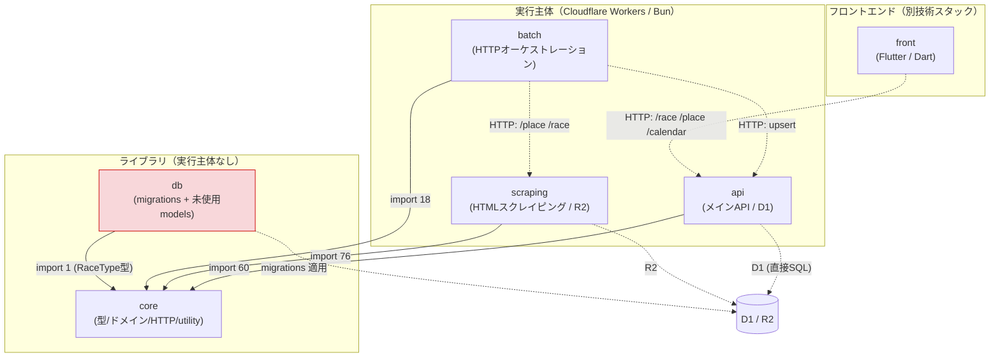
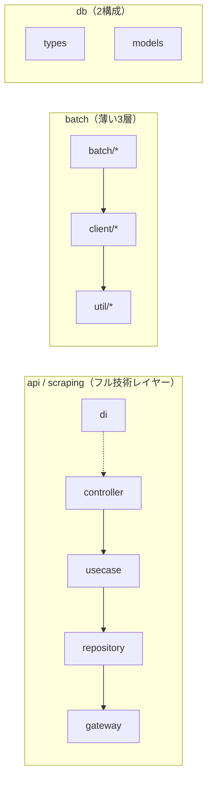

# アーキテクチャ概観（モジュール構成・依存関係）

> 目的: race-schedule モノレポ（bun workspaces / TypeScript + Flutter）の現状のパッケージ構成と依存関係を俯瞰し、モジュール再編の土台とする調査ドキュメント。
> 対象コミット時点の `packages/` 実態に基づく。**本ドキュメントはコード変更を伴わない調査結果である。**

---

## 1. パッケージ一覧と役割

| パッケージ   | name                      | 実体の役割（コードから判定）                                                                                                                                                  | ランタイム                    | 言語     | src ファイル数 |
| ------------ | ------------------------- | ----------------------------------------------------------------------------------------------------------------------------------------------------------------------------- | ----------------------------- | -------- | -------------- |
| **api**      | `@race-schedule/api`      | メイン API サーバ。D1(SQLite) への読み書き、Google Calendar 連携。controller/usecase/repository/gateway/di の技術レイヤー構成                                                 | Cloudflare Workers            | TS       | 50             |
| **scraping** | `@race-schedule/scraping` | 競馬/競輪等の HTML スクレイピング。R2 に生 HTML を保存し parser で構造化。api と同じ技術レイヤー + `parser/` `request/`                                                       | Cloudflare Workers            | TS       | 54             |
| **batch**    | `@race-schedule/batch`    | スクレイピング API とメイン API を **HTTP 経由でオーケストレーション**する薄い実行主体。util/client/batch の 3 層のみ                                                         | Cloudflare Workers / Bun CLI  | TS       | 16             |
| **core**     | `@race-schedule/core`     | 共有ライブラリ。types / utilities / constants / schemas / http / filters / entity / controller / domain(master,model,policy,service,rule)。**全 TS パッケージが依存する土台** | ライブラリ（実行主体なし）    | TS       | 123            |
| **db**       | `@race-schedule/db`       | D1 マイグレーション（SQL）と wrangler 設定。加えて types/schemas と models の TS を持つが**ランタイムからは未使用**（後述）                                                   | ライブラリ / migration ツール | TS + SQL | 10             |
| **front**    | `@race-schedule/front`    | Flutter アプリ（iOS/Android/Web）。Clean Architecture + Atomic Design。api を HTTP で叩く。**TS 依存グラフの外側**                                                            | Flutter                       | Dart     | 47             |

補足:

- `packages/README.md` には `shared` パッケージ行があるが**実在しない**（実体は `core`）。ドキュメントドリフト。詳細は `module-boundary-issues.md` を参照。
- `packages/docs/` はドキュメント置き場（パッケージではない）。

---

## 2. 現状のパッケージ依存グラフ（Mermaid）

- 実線 = TypeScript の静的 import 依存
- 破線 = 実行時のネットワーク / ストレージ連携（静的依存ではない）
- 赤 = 実質未使用のコード資産を含むパッケージ（`db` の TS models）

---

## 3. 依存の向きに関する所見（要点）

1. **依存の向きは健全で単方向**。`api / scraping / batch / db` はすべて `core` のみに依存し、相互依存はゼロ。`core` は他パッケージへ依存しない（葉ノード）。**パッケージ間の循環依存は存在しない**（`import/no-cycle` が全パッケージで error）。
2. **`db` パッケージは依存グラフ上ほぼ孤立**。`@race-schedule/db` を import しているのは自身の barrel のみ。api は D1 に**独自の `DBGateway` + mapper で直接アクセス**しており、`db/src/models` を使っていない。→ `dependency-analysis.md` / `module-boundary-issues.md` で詳述。
3. **`batch` はストレージに触れない**。README は「D1 / Google Sheets」を storage と記すが、実コードは scraping API とメイン API を HTTP で呼ぶだけ。実行主体の性質（誰がいつ動かすか）と役割名が噛み合っていない。
4. **`core` の肥大化**。123 ファイルで、純ドメイン・HTTP 境界ヘルパー・DTO/entity・多数の utility・3 系統の検証（schemas/filters/domain）が同居。分割候補は `reorganization-proposal.md` を参照。
5. **`front` は独立技術スタック（Dart）**。TS 依存グラフに現れず、api とは HTTP 契約でのみ結合。モノレポの物理配置は共有するが、TS 側の再編とは切り離して扱える。

---

## 4. パッケージ内レイヤー構成の実態

- **api / scraping**: controller → usecase → repository → gateway の Interface ベース DI 構成。scraping はこれに加え `parser/`（14 ファイル）と `request/` を持つ。
- **batch**: `batch/`（place/race/calendar の実行単位）→ `client/`（HTTP クライアント）→ `util/`。repository/gateway/DI 層を持たない別系統の薄い構成。
- **db**: `types/`（Row 型）+ `models/`（変換ロジック）。テストは `test/unittest/models` のみ。
- **core**: 技術レイヤーではなくカテゴリ別（types/domain/http/utilities/…）。

境界の問題点は `module-boundary-issues.md`、再編案は `reorganization-proposal.md` を参照。
