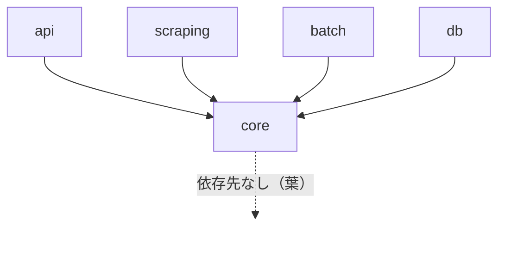
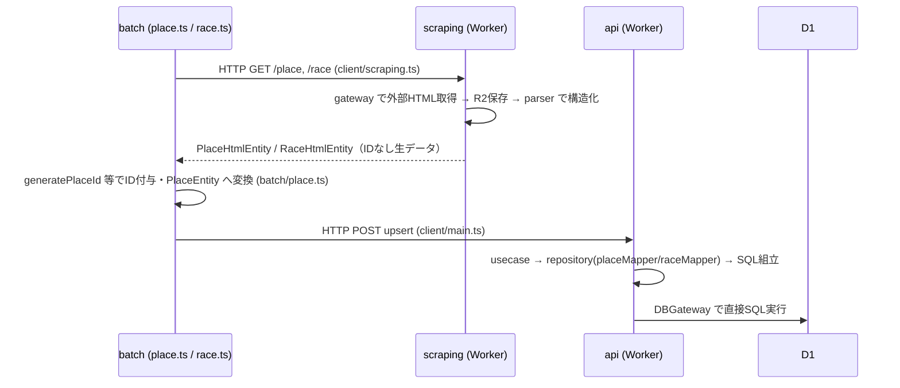

# 依存関係分析（パッケージ間依存グラフと問題点）

> `@race-schedule/xxx` 形式の import を静的解析し、依存グラフと問題（孤立・境界越え・重複）をファイルパス付きで指摘する。
>
> **本書は 2026-07-26 時点のスナップショット**。以後のリファクタで記載パスが現存しない
> 場合がある（`bun run check:stale-aidlc-docs` で検出）。現状のパッケージ間依存は
> `packages/README.md` §依存関係を参照。

---

## 1. パッケージ間 import 実測

各パッケージ `src/` 内での `@race-schedule/*` import 出現数（grep 実測）:

| import 元 → | core    | db      | 備考                                              |
| ----------- | ------- | ------- | ------------------------------------------------- |
| api         | 60      | 0       | core のみ                                         |
| scraping    | 76      | 0       | core のみ                                         |
| batch       | 18      | 0       | core のみ                                         |
| db          | 1       | 1(自身) | core から `RaceType` を 1 箇所                    |
| core        | 2(自身) | 0       | core 内部での自己参照（`import/no-cycle` 監視下） |

**結論: TS の静的依存は `X → core` の単方向スターグラフ。相互依存・循環はゼロ。**

---

## 2. 実行時（ネットワーク/ストレージ）依存 — 静的 import に現れない結合

静的グラフは綺麗だが、**実データフローは HTTP を跨ぐ**ため、パッケージ境界と実際の結合が一致しない。

「スクレイピングして取得したデータを加工・保存する」フローの追跡:

関与ファイル（主要）:

- `packages/batch/src/batch/place.ts` … スクレイピング取得 → ID 付与 → メイン API へ upsert
- `packages/batch/src/client/scraping.ts` … スクレイピング API 呼び出し（チャンク分割）
- `packages/batch/src/client/main.ts` … メイン API へ POST（`postJson`）
- `packages/scraping/src/usecase/implement/placeUsecase.ts` → `gateway/implement/placeDataHtmlGateway.ts` → `parser/implement/placeHtmlParser*.ts`
- `packages/api/src/usecase/implement/placeUsecase.ts` → `repository/implement/placeRepository.ts` → `placeMapper.ts` → `gateway/implement/dbGateway.ts`

**所見**: 型（`PlaceEntity` / `RaceEntity` / `PlaceHeldDays`）を core が握るため HTTP を跨いでも型整合は取れているが、**「同じ place/race を 3 パッケージがそれぞれ変換する」**構造（scraping の DTO 変換、batch の Entity 変換、api の mapper 変換）になっており、変換ロジックが分散している。

---

## 3. 問題点

### 3.1 `db` パッケージの孤立（デッドコード）

- `@race-schedule/db` を import しているのは **`packages/db/src/index.ts` の JSDoc コメントのみ**。実コードからの参照ゼロ。
- api は D1 に独自アクセス:
    - `packages/api/src/gateway/implement/dbGateway.ts` … `EnvStore.env.DB.prepare(sql)` を直叩き
    - `packages/api/src/repository/implement/placeMapper.ts` / `raceMapper.ts` / `fetchSqlBuilder.ts` … 行 ↔ エンティティ変換と SQL を独自実装
- 一方 `packages/db/src/types/schemas.ts`（`PlaceRow` 等）と `packages/db/src/models/*.model.ts` は **どこからも使われていない**。
- **影響**: DB スキーマの「正」が二重化（db/types/schemas.ts と api の mapper が暗黙に持つ列知識）。マイグレーションで列を変えたとき、型で守られず api の mapper 修正漏れが検出できない。db パッケージの価値は実質 `migrations/*.sql` のみ。

### 3.2 検証（validation）ロジックの三重分散（core 内）

同じ「入力検証」の責務が core 内の 3 ディレクトリに散る:

- `packages/core/src/schemas/`（`placeFilterValidation.ts`, `raceUpsertValidation.ts` 等 Zod）
- `packages/core/src/filters/`（`calendarFilterParams.ts` 等）
- `packages/core/src/domain/model/valueObject/`（`placeId.ts` 等のブランド型 Zod）
- 加えて `packages/core/src/types/`（`raceType.ts` 等も Zod スキーマを内包）

**影響**: 「新しい検証をどこに書くか」の判断基準が不明瞭で、レビュー時の一貫性が保てない。

### 3.3 HTTP 境界ヘルパーの二重ディレクトリ（core 内）

- `packages/core/src/http/`（cacheControl, cors, errorResponse, queryParamParser）
- `packages/core/src/controller/`（parse, parseBodyOrBadRequest, parseOrBadRequest, response）

両者とも「HTTP リクエスト/レスポンスの純ロジック」で責務が重なる。共有ライブラリ内に `controller` 層があること自体が命名の誤り。

### 3.4 router / エラーハンドラ / キャッシュの重複（api ↔ batch）

- `packages/api/src/router.ts:364` `onError`、`:377` `createCacheControlMiddleware`
- `packages/api/src/utility/errorHandler.ts` / `utility/cacheControl.ts`
- `packages/batch/src/router.ts:297` `internalErrorResponseBody(error)` を独自配線
- リポジトリに専用 skill（`consolidate-router`）が存在するほど既知の重複。

### 3.5 変換（mapper / DTO）ロジックの分散

- api: `repository/implement/placeMapper.ts`, `raceMapper.ts`
- scraping: `utility/mapPlaceEntityToDto.ts`, `utility/mapRaceHtmlEntityToDto.ts`
- batch: `util/batchEntityHelpers.ts`
- 同じ place/race ドメインの変換が 3 パッケージに分散。core に集約余地。

### 3.6 日時ユーティリティの重複疑い

- `packages/core/src/utilities/dateJst.ts`（`getJstDate`, `toJstISOString` 等）
- `packages/batch/src/util/timezone.ts`（`formatJstDatetime`）
- batch 側が core の JST ヘルパーを使い切れておらず独自実装している可能性。

---

## 4. 良好な点（維持すべき設計）

1. **循環依存ゼロ** — `import/no-cycle`（全パッケージ, maxDepth 5）で静的に担保。
2. **パッケージ境界越えの相対 import ゼロ** — `import/no-relative-packages` 遵守。`../../core/src/...` のような侵入は grep で 0 件。
3. **core の公開面キュレーション** — `core/src/index.ts` が使用シンボルのみ手動 re-export（#136）。内部ヘルパーは非公開で、他パッケージが内部構造に依存できない。
4. **単方向スターグラフ** — 依存の向きが `X → core` に統一され、責務分割の議論を進めやすい健全な土台。
