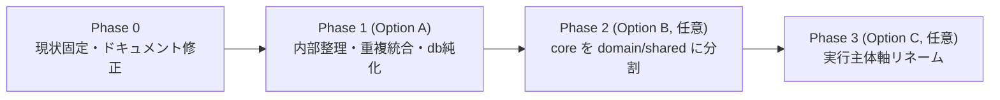

# モジュール再編提案

> `architecture-overview` / `dependency-analysis` / `module-boundary-issues` を踏まえた再編案。
> 選択肢を比較し、推奨案と段階移行ステップを提示する。**本ドキュメントは提案であり、実装は別途承認後に行う。**

---

## 1. モジュール分割の目的（何のために分けるのか）

再編の判断軸を先に明確化する。現状の分割は「技術レイヤー（controller/usecase/repository/gateway）」主体だが、分割目的は本来複数ある:

| 目的                      | 説明                                              | 現状の達成度                                                   |
| ------------------------- | ------------------------------------------------- | -------------------------------------------------------------- |
| **デプロイ単位の分離**    | Cloudflare Worker として別々にデプロイする単位    | ◎ api/scraping/batch は Worker 単位で分かれている              |
| **テストしやすさ**        | 純ロジックを I/O から切り離し高速・決定的にテスト | △ core は純だが環境依存コードが混在。api テストが src と不一致 |
| **循環依存の回避**        | 依存を単方向に保つ                                | ◎ 単方向スターグラフ、循環ゼロ                                 |
| **変更の局所化**          | ドメイン変更が 1 箇所で済む                       | △ place/race 変換が 3 パッケージに分散、DB スキーマ二重管理    |
| **チーム分担 / 認知負荷** | 「どこに何を書くか」が自明                        | △ core が grab-bag、検証/VO/HTTP が多重配置                    |
| **再利用境界**            | フロント非依存の純ドメインを独立利用              | △ 純ドメインが Cloudflare 依存コードと同居                     |

**問題の本質**: デプロイ単位と循環回避は既に良好。負債は **(a) core の grab-bag 化、(b) db のデッドコード/型二重管理、(c) ドメイン変換・検証の多重配置** に集中している。→ 再編は「Worker の切り方」より「**core の内部整理と db の役割再定義**」が主戦場。

---

## 2. ドメイン境界 vs 技術レイヤー境界の評価

- **パッケージ間**は「実行主体（Worker）」軸が妥当で、維持すべき。ドメイン（競技種別）ごとに Worker を割る必要はない（デプロイ・運用が煩雑になるだけ）。
- **パッケージ内**、特に以下はドメイン軸が有効:
    - `scraping/src/parser/`（14 ファイルが jra/nar/keirin/autorace/boatrace/overseas に既に分かれている）→ 競技種別ドメイン軸での基底クラス抽出（`refactor-parser` skill と整合）。
    - `core/src/domain/`（master/model/policy/rule/service）は既にドメイン軸で凝集度が高い。これを core の中心に据える。
- 逆に **core の `controller/` `http/` `schemas/` `filters/` `types/`** は技術関心が細切れに散っており、技術軸での再集約が要る。

**結論**: 「パッケージ間 = 実行主体軸（現状維持）」「core 内部 = ドメイン軸を中心に技術関心を再集約」「parser = ドメイン軸で共通化」の三層で考える。

---

## 3. batch / api / scraping の役割再定義案

実行主体（誰がいつ動かすか）と処理内容で整理し直す:

| パッケージ   | 実行契機                              | 処理内容                                               | あるべき責務の明確化                                                                                                      |
| ------------ | ------------------------------------- | ------------------------------------------------------ | ------------------------------------------------------------------------------------------------------------------------- |
| **api**      | HTTP リクエスト（front / batch から） | D1 の読み書き、Google Calendar 連携                    | 「永続化とカレンダーの唯一の書き込み口」。DB スキーマの正を持つべき（ISSUE-01 の受け皿）                                  |
| **scraping** | HTTP リクエスト（batch から）/ 手動   | 外部 HTML 取得 → R2 保存 → parser で構造化             | 「外部データ取得と構造化の責務」。DB は触らない（現状通り）                                                               |
| **batch**    | スケジュール（cron）/ CLI             | scraping と api を HTTP で順次呼ぶオーケストレーション | 「**保存層を持たない実行オーケストレータ**」であることを命名・構造で表現（ISSUE-08）。`client/` は gateway 相当と位置づけ |

命名の改善余地（任意）: `batch/src/batch/` のネスト解消（例: `batch/src/jobs/`）、`client/` → `gateway/` へ寄せると api/scraping と語彙が揃う。

---

## 4. core の肥大化解消案

core を「純ドメイン中心」に絞り、性質の異なるものを分離する。分割候補:

| 現状（core 内）                                                         | 分類                    | 提案                                                                                                  |
| ----------------------------------------------------------------------- | ----------------------- | ----------------------------------------------------------------------------------------------------- |
| `domain/`（master/model/policy/rule/service）, `entity/`                | 純ドメイン              | **core の中心として残す**。`types/` の値オブジェクトを `domain/model/valueObject/` に統合（ISSUE-03） |
| `http/` + `controller/`                                                 | HTTP 境界（純ロジック） | 1 ディレクトリ（例 `http/`）に統合。`controller` 名は廃止（ISSUE-04）                                 |
| `schemas/` + `filters/`                                                 | 検証                    | `schemas/` に集約、または各値の定義近傍へ（ISSUE-05）                                                 |
| `utilities/` の環境依存（`cloudFlareEnv`, `envStore`, `diInitializer`） | インフラ/環境依存       | 純 utility と分離（サブディレクトリ or 別パッケージ `platform`）                                      |
| `utilities/` の純関数（`dateJst`, `format`, `url`, `splitCsv` …）       | 汎用純 utility          | `utilities/` に残す                                                                                   |

分割は「ディレクトリ整理（軽）」から「パッケージ分割（重）」まで段階がある（下記オプション参照）。

---

## 5. 再編オプション比較

### Option A — 内部整理（パッケージ数は変えない）

各パッケージ内のディレクトリ整理 + db のデッドコード整理 + 重複統合 + ドキュメント修正。

- **メリット**: 破壊的変更が小さい。`import/no-cycle` / `no-relative-packages` の前提を崩さない。1 PR ずつ安全に進む。効果（認知負荷・重複）の大半を回収できる。
- **デメリット**: core の「純ドメイン vs 環境依存」の物理境界は付かない（ディレクトリ止まり）。
- **移行コスト**: 低（各 1 PR、既存テストで担保）。

### Option B — core の 2〜3 分割

`@race-schedule/domain`（純ドメイン + entity）/ `@race-schedule/shared`（http/utility/constants）/ 既存 `core` は互換 barrel or 廃止。

- **メリット**: 純ドメインが環境依存から物理的に独立。テストが速く決定的に。再利用境界が明確。
- **デメリット**: 全パッケージの import 差し替え（`@race-schedule/core` 参照はソース **103 箇所** / テスト込み **227 箇所**、実測）。`core/src/index.ts` の公開面を 2 つに割る設計が要る。移行中の二重メンテ。
- **移行コスト**: 中〜高（複数 PR + import 一括置換 + CI 全通し）。

### Option C — 実行主体軸のリネーム + db 役割純化

パッケージ名を役割が伝わる形へ（例 `worker-api`, `worker-scraping`, `job-batch`, `lib-domain`, `lib-shared`, `db-migrations`, `app-front`）。db は migrations 専用に純化。

- **メリット**: リポジトリを一目で「実行主体 / ライブラリ / DB / フロント」に分類できる。新規参画の理解が速い。
- **デメリット**: 名前変更の churn が最大（wrangler.toml, CI, デプロイ設定, ドキュメント全般）。機能的利得は B より小さい。
- **移行コスト**: 高（設定・デプロイ・ドキュメント広範）。

### 比較サマリ

| 観点              | Option A       | Option B       | Option C       |
| ----------------- | -------------- | -------------- | -------------- |
| 認知負荷の低減    | 中             | 高             | 中（命名で高） |
| core 肥大化の解消 | 中（dir 整理） | 高（物理分割） | 中             |
| db 二重管理の解消 | 高             | 高             | 高             |
| 破壊範囲          | 小             | 大             | 最大           |
| 移行コスト        | 低             | 中〜高         | 高             |
| リスク            | 低             | 中             | 中〜高         |

---

## 6. 推奨案

**Option A を第 1 フェーズとして先行 → 効果を見て Option B（core 分割）を第 2 フェーズで選択的に。Option C（リネーム）は任意・最後。**

理由:

- 現状の依存グラフは既に健全（循環ゼロ・単方向）なので、**破壊的な再配置より「grab-bag と重複と二重管理の解消」が費用対効果最大**。
- db デッドコード整理・重複統合・ドキュメント修正は A の範囲で完結し、リスクが低い。
- core の物理分割（B）は import 全置換を伴うため、A で内部ディレクトリを先に整えておくと B の切り出し線が自明になり、B の移行が安全になる。
- リネーム（C）は機能利得が小さく、A/B の後にドキュメント整備の一環として判断すれば十分。

---

## 7. 段階移行ステップ（推奨ルート）

- **Phase 0**: `packages/README.md` のドリフト修正（shared→core、service/stub 記述の是正）。再編の前提共有。
- **Phase 1（Option A）**: db デッドコード判断、core の VO 統合・http/controller 統合・検証集約、router/mapper 重複統合、テスト配置是正。各 1 PR。
- **Phase 2（Option B, 任意）**: core を `domain` / `shared` に物理分割。import 一括置換。
- **Phase 3（Option C, 任意）**: 実行主体軸へのリネーム。

具体的な 1 PR 粒度のタスクは `reorganization-tasks.md` を参照。
