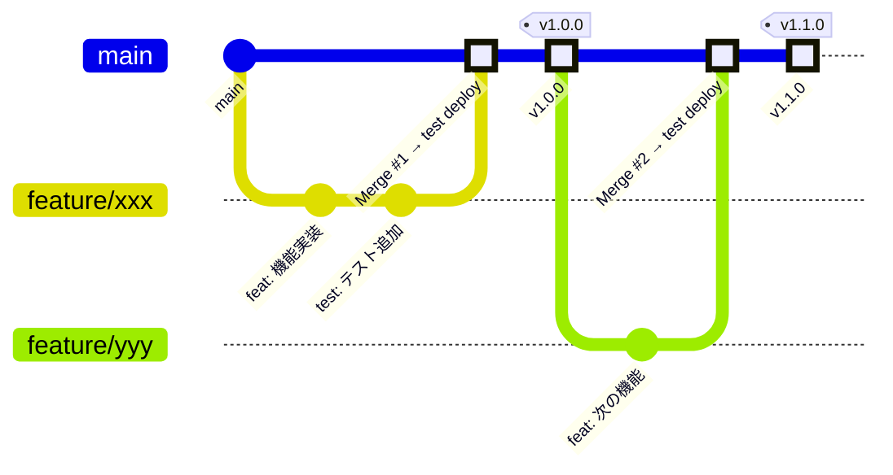
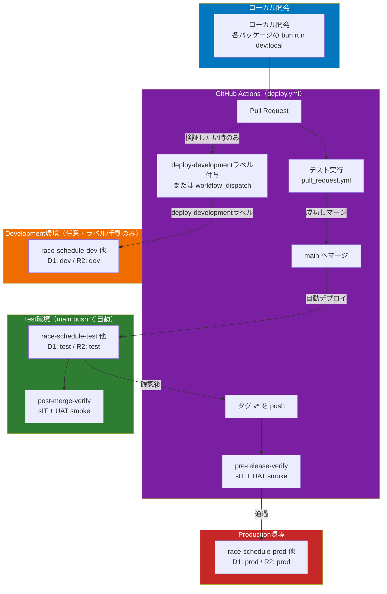
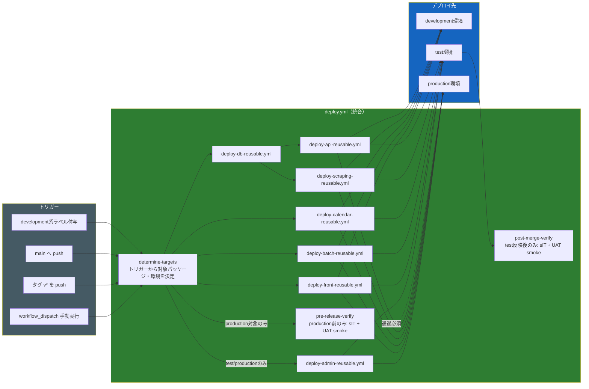
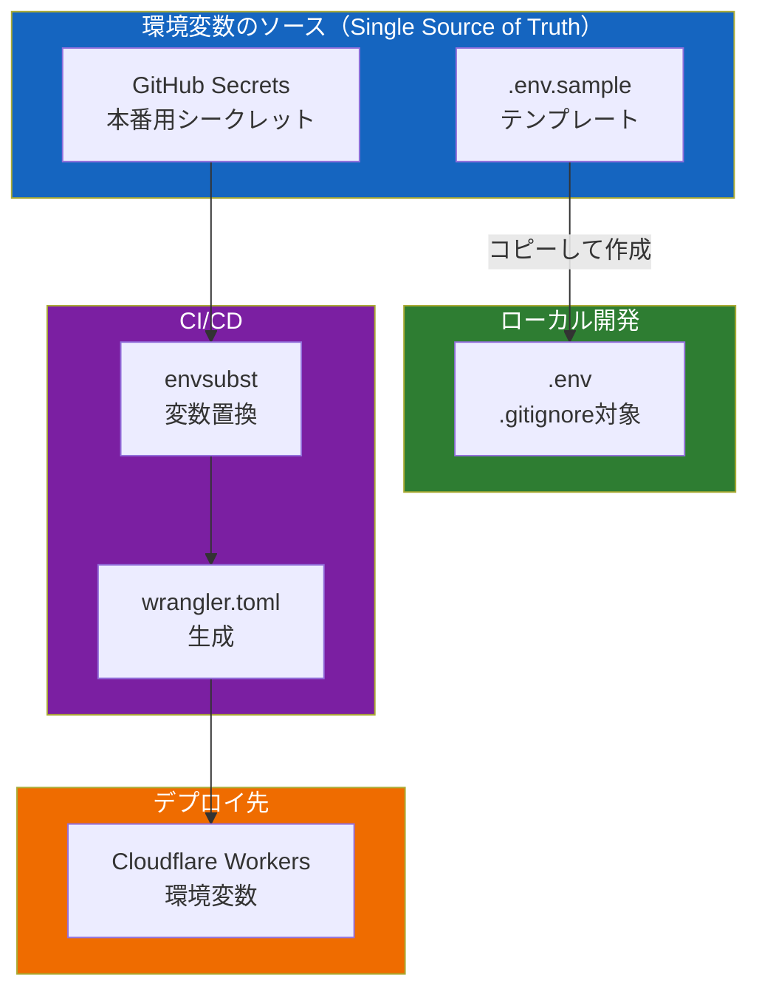

# packages 運用ガイド

このドキュメントでは、race-schedule プロジェクトの monorepo 構成における packages ディレクトリの運用方法をまとめています。

---

## 目次

1. [各パッケージのドキュメント](#各パッケージのドキュメント)
2. [パッケージ構成](#パッケージ構成)
3. [アーキテクチャ設計](#アーキテクチャ設計)
4. [開発フロー](#開発フロー)
5. [Gitフロー](#gitフロー)
6. [デプロイフロー](#デプロイフロー)
7. [環境変数管理](#環境変数管理)
8. [バッチ処理](#バッチ処理)
9. [主要コマンド](#主要コマンド)

---

## 各パッケージのドキュメント

各パッケージの詳細な使用方法やセットアップ、テスト計画については、以下を参照してください:

| パッケージ   | README                          | SETUP                                  | TEST_PLAN                        | その他                                   |
| ------------ | ------------------------------- | -------------------------------------- | -------------------------------- | ---------------------------------------- |
| **admin**   | [README.md](admin/README.md)    | [SETUP.md](admin/SETUP.md)             | -                                 | -                                        |
| **api**      | [README.md](api/README.md)      | [SETUP.md](api/SETUP.md)               | -                                 | -                                        |
| **scraping** | [README.md](scraping/README.md) | [SETUP.md](scraping/SETUP.md)          | -                                | -                                        |
| **batch**    | [README.md](batch/README.md)    | [SETUP_LOCAL.md](batch/SETUP_LOCAL.md) | -                                | -                                        |
| **calendar** | [README.md](calendar/README.md) | [SETUP.md](calendar/SETUP.md)          | -                                | -                                        |
| **db**       | [README.md](db/README.md)       | [SETUP.md](db/SETUP.md)                | [TEST_PLAN.md](db/TEST_PLAN.md)  | -                                        |
| **front**    | [README.md](front/README.md)    | [SETUP.md](front/SETUP.md)             | -                                | [ARCHITECTURE.md](front/ARCHITECTURE.md) |
| **core**     | [README.md](core/README.md)     | -                                      | -                                | -                                        |

設計の背景（`api`をD1唯一のアクセス点とし、`scraping`/`calendar`をステートレスなアダプタとする方針に至った経緯）は [calendar-extraction-design.md](../aidlc-docs/inception/reverse-engineering/calendar-extraction-design.md) を参照してください。

---

## パッケージ構成

```
packages/
├── api/        # メインAPI（Cloudflare Workers + D1）
├── admin/      # 運用者専用管理Worker（Cloudflare Access保護、Cloudflare Workers）
├── scraping/   # HTMLスクレイピングワーカー（Cloudflare Workers + R2）
├── batch/      # バッチ処理オーケストレーション（scraping/api をHTTPで呼ぶ）
├── calendar/   # Google Calendar同期ワーカー（Cloudflare Workers）
├── core/       # 共有ドメインモデル・ユーティリティ（全パッケージが依存）
├── db/         # データベーススキーマ・マイグレーション管理
└── front/      # フロントエンドアプリケーション（Flutter）
```

| パッケージ                | 役割                           | ランタイム         | ストレージ                                |
| ------------------------- | ------------------------------ | ------------------ | ----------------------------------------- |
| `@race-schedule/api`      | メインAPIサーバー              | Cloudflare Workers | D1（SQLite）                              |
| `@race-schedule/admin`    | 運用者専用管理画面             | Cloudflare Workers | -（api をHTTP呼び出し）                   |
| `@race-schedule/scraping` | HTMLスクレイピング             | Cloudflare Workers | R2                                        |
| `@race-schedule/batch`    | バッチ処理オーケストレーション | Node.js / Bun      | -（api/scraping/calendar をHTTP呼び出し） |
| `@race-schedule/calendar` | Google Calendar同期            | Cloudflare Workers | -（api をHTTP呼び出し）                   |
| `@race-schedule/core`     | 共有ドメイン・ユーティリティ   | -                  | -                                         |
| `@race-schedule/db`       | DBマイグレーション             | -                  | D1                                        |
| `@race-schedule/front`    | フロントエンド                 | Flutter            | -                                         |

### 依存関係

全パッケージ（front を除く）は `@race-schedule/core` にのみ依存する。パッケージ間の相互依存・循環依存はない（`import/no-cycle`, `import/no-relative-packages` で静的に担保）。`front` は Flutter/Dart 製で、api と HTTP 契約でのみ結合する。

```
api ──────────────────┐
                      │
scraping ─────────────┼──► core
                      │
batch ────────────────┤
                      │
calendar ──────────────┤
                      │
admin ──────────────────┤
                      │
db ────────────────────┘

front ─────(HTTP)─────► api
admin ─────(HTTP)─────► api
```

`core` を `@race-schedule/domain`/`@race-schedule/shared` へ物理分割する再編案が検討中
（未承認）。詳細は [`docs/architecture/`](../docs/architecture/README.md) を参照。

---

## アーキテクチャ設計

### レイヤーアーキテクチャ

各パッケージは以下のレイヤー構成に準拠します（src ディレクトリと同様）。

```
┌─────────────────────────────────────────┐
│         Controller Layer                │  HTTP リクエスト/レスポンス処理
│         (router.ts, controller/)        │
├─────────────────────────────────────────┤
│         UseCase Layer                   │  ビジネスロジック
│         (usecase/)                      │
├─────────────────────────────────────────┤
│         Repository Layer                │  データアクセス抽象化
│         (repository/interface/)         │  ※ Interface定義で実装を切り替え
├─────────────────────────────────────────┤
│         Gateway Layer                   │  外部API・DB・ストレージ連携
│         (gateway/, repository/implement)│
└─────────────────────────────────────────┘
```

### ディレクトリ構造（標準）

api / scraping / calendar / admin（HTTP を受ける Worker）の実際の構成:

```
packages/{api,scraping,calendar,admin}/
├── src/
│   ├── index.ts            # エントリーポイント
│   ├── router.ts           # ルーティング定義（Hono）
│   ├── di/                 # DI Container 設定（tsyringe）。index.ts がエントリポイント
│   ├── controller/         # Controller 層（HTTP リクエスト/レスポンス）
│   ├── usecase/            # UseCase 層（ビジネスロジック）
│   │   ├── interface/
│   │   └── implement/
│   ├── repository/         # Repository 層（データアクセス抽象化）
│   │   ├── interface/      # インターフェース定義
│   │   └── implement/      # 実装
│   ├── gateway/            # 外部連携（HTTP クライアント等）
│   │   ├── interface/
│   │   └── implement/
│   └── utility/            # ユーティリティ
├── test/
│   └── unittest/           # UT（src と同構造でミラー）
├── wrangler.toml           # Cloudflare Workers 設定
├── package.json
└── tsconfig.json
```

`batch` はより薄い構成（`client/`, `batch/`）で、DB/R2/Google Calendar に直接触れず scraping/api/calendar を HTTP で呼び出すオーケストレータ。`core` はレイヤー構成を持たず `domain/`, `types/`, `utilities/`, `http/`, `dto/`, `schemas/`, `constants/`, `entity/` からなる共有ライブラリ。テストランナーは `bun:test`（vitest ではない）。`stub/` ディレクトリは現状使用していない。

### 設計原則

1. **Interface-based Repository Pattern**
    - Repository は必ず interface を定義
    - 実装は `implement/` ディレクトリに配置
    - テストではモック実装を用いる（`stub/` ディレクトリは現状未使用）

2. **依存性注入（DI）**
    - `tsyringe` を使用
    - `di/`（`index.ts` がエントリポイント）でコンテナを設定

3. **coreパッケージの活用**
    - 型定義、エンティティ、ユーティリティは `@race-schedule/core` を使用
    - 重複実装を避ける

---

## 開発フロー

### ローカル開発

`dev` 系スクリプトはルートではなく各パッケージの `package.json` に定義されている
（`bun run dev:local` を root で実行しても存在しない）。

```bash
# 1. 依存関係インストール
bun install

# 2. ローカルDB準備（初回のみ）
cd packages/db
bun run migrations:apply:local

# 3. 各パッケージの開発サーバー起動
cd packages/api && bun run dev:local        # API（ローカルWrangler）
cd packages/scraping && bun run dev         # Scraping（リモートtest環境に接続）
```

### development 環境へのデプロイ（任意）

個人の検証用として Cloudflare に development 環境を作成できます。

```bash
# development 環境へデプロイ
cd packages/api
bun run deploy:development

cd packages/scraping
bun run deploy:development
```

---

## Gitフロー



### ブランチ戦略

| ブランチ      | 用途         | デプロイ先                       |
| ------------- | ------------ | -------------------------------- |
| `feature/*`   | 機能開発     | -                                |
| `fix/*`       | バグ修正     | -                                |
| `main`        | 統合ブランチ | test環境（マージ時自動）         |
| タグ `v*.*.*` | リリース     | production環境（タグ作成時自動） |

### 運用ルール

1. **機能開発**: `feature/xxx` ブランチを作成
2. **PR作成**: main ブランチへのPRを作成
3. **レビュー・マージ**: PR承認後、main にマージ → **test環境に自動デプロイ**
4. **リリース**: タグ（`v1.0.0`など）を切る → **production環境に自動デプロイ**

```bash
# タグの作成とプッシュ
git tag v1.0.0
git push origin v1.0.0
```

---

## デプロイフロー

> **2026-07-29 更新**: [`execution-plan-release-strategy.md`](../aidlc-docs/inception/plans/execution-plan-release-strategy.md)
> による見直し（#2175）で、旧`deploy-{dev,test,prod}.yml`等の個別ワークフローとアドホックな
> `deploy-*-test`/`deploy-production`系ラベルは廃止。現在は統合ワークフロー
> [`deploy.yml`](../.github/workflows/deploy.yml) 1本が全パッケージ（admin/api/scraping/calendar/
> batch/front/db）を管轄し、パッケージごとの`deploy-{admin,api,batch,calendar,db,front,scraping}-reusable.yml`
> を呼び出す。development環境のみラベルトリガーが残る（test環境=常にmainの最新状態という
> UAT smokeの前提を、マージ前のPRブランチによる上書きから守るため）。

### 全体フロー



### 環境別デプロイ詳細



### deploy.yml のジョブ構成

すべて単一ワークフロー [`.github/workflows/deploy.yml`](../.github/workflows/deploy.yml) 内のジョブ。

| ジョブ                      | 実行条件                                                     | 内容                                          |
| ---------------------------- | -------------------------------------------------------------- | ----------------------------------------------- |
| `determine-targets`          | 常時                                                            | トリガー種別（push/タグ/ラベル/手動）から環境・対象パッケージを決定 |
| `pre-release-verify`         | production 向けデプロイの直前のみ                                | sIT + UAT smoke。失敗時はデプロイを止める（FR-01） |
| `deploy-db`                  | `determine-targets` の判定結果次第                              | `deploy-db-reusable.yml` を呼び出し             |
| `deploy-api` / `deploy-scraping` | 同上（`deploy-db` 完了後）                                  | 各 `deploy-{api,scraping}-reusable.yml`         |
| `deploy-calendar` / `deploy-batch` / `deploy-front` | 同上                                       | 各 `deploy-{calendar,batch,front}-reusable.yml` |
| `deploy-admin`                | 同上（`deploy-api` 完了後、test/production環境のみ）             | `deploy-admin-reusable.yml`                     |
| `remove-label`                | ラベルトリガー時                                                | 処理済みラベルを除去                            |
| `post-deploy-verify`          | デプロイ後                                                      | デプロイ結果の疎通確認                          |
| `post-merge-verify`           | `main` へのマージ経由デプロイ完了後                              | sIT + UAT smoke。失敗時は GitHub Issue で通知（早期検知が目的、production ゲートの代替ではない） |

トリガー別の環境:

| トリガー                                | 環境        | 対象                                                  |
| ---------------------------------------- | ----------- | ------------------------------------------------------ |
| `main` へのpush                          | test        | api / scraping / calendar / batch / front（常に）、admin（`packages/admin/`またはcoreに変更がある場合）、db（`packages/db/` に変更がある場合のみ） |
| タグ `v*` のpush                         | production  | api / scraping / calendar / batch / front（常に）、admin（`packages/admin/`またはcoreに変更がある場合）、db（前回タグとの差分がある場合のみ） |
| `deploy-development` 等のラベル付与       | development | ラベルに対応するパッケージ1つ（下表）                    |
| `workflow_dispatch`                      | 選択した環境 | 選択したパッケージ                                       |

旧`deploy-{dev,test,prod}.yml`等のパッケージ別ワークフロー、および`deploy-test`/
`deploy-scraping-test`/`deploy-db-test`/`deploy-batch-test`/`deploy-front-test`/
`deploy-production`系ラベルは#2175で廃止済み。理由・経緯は
[`execution-plan-release-strategy.md`](../aidlc-docs/inception/plans/execution-plan-release-strategy.md)を参照。

### Development環境へのデプロイ方法

Issue または Pull Request に以下のラベルを付与することで、development環境にデプロイできます。

| ラベル                          | デプロイ対象         |
| -------------------------------- | --------------------- |
| `development-deploy`             | 全パッケージ一括       |
| `deploy-development`             | api                    |
| `deploy-db-development`          | db（マイグレーション） |
| `deploy-scraping-development`    | scraping               |
| `deploy-calendar-development`    | calendar               |
| `deploy-batch-development`       | batch                  |
| `deploy-front-development`       | front                  |

または、GitHub Actions の `workflow_dispatch` から手動実行も可能です（test/production環境も選択可）。

---

## 環境変数管理

### 環境変数の一元管理方針

**重複運用・手運用を避けるため、以下のルールを遵守します。**



### 環境変数ファイル一覧

実在するのは `.env.example`（テンプレート）のみ。`.env.dev`/`.env.test`/`.env.production`/
`.env.sample` のようなファイルは存在せず、CI では GitHub Secrets/Variables から
`envsubst` で `wrangler.toml` に直接注入する（下記「wrangler.toml の環境変数置換」参照）。

| ファイル        | 用途                       | Git管理       | 備考                       |
| ---------------- | -------------------------- | ------------- | --------------------------- |
| `.env.example`   | テンプレート・全変数の一覧 | ✅ 管理する   | 新規参加者はこれをコピーする |
| `.env.local`     | ローカル開発                | ❌ .gitignore | 個人環境                    |

### GitHub Secrets（全環境共通・本番用）

以下のシークレットは GitHub リポジトリの Settings > Secrets and variables に登録します。
値の内容・粒度は `.env.example` が一次情報源。

| Secret名                | 用途                                                          |
| ----------------------- | ------------------------------------------------------------- |
| `CLOUDFLARE_WORKERS_API_TOKEN` | Workers（api/batch/scraping/calendar/admin）の`wrangler deploy`専用。必要な権限: `Workers Scripts:Edit` |
| `CLOUDFLARE_PAGES_API_TOKEN` | Cloudflare Pages（front/widgetbook/ci-report）の`wrangler pages deploy`専用。必要な権限: `Cloudflare Pages:Edit` |
| `CLOUDFLARE_D1_API_TOKEN` | D1マイグレーション・バックアップ（`deploy-db-reusable.yml`）専用。必要な権限: `D1:Edit`。ローカルの`db:shell:production`等でも同スコープのトークンを使う |
| `CLOUDFLARE_ANALYTICS_API_TOKEN` | エラー監視（`error-monitor.yml`・api Workerのscheduledハンドラ）専用の読み取り専用トークン。必要な権限: `Account Analytics:Read`のみ |
| `TF_CLOUDFLARE_API_TOKEN` | Terraform（R2バケット管理、`infra/terraform/`）専用。必要な権限: `Workers R2 Storage:Edit` |
| `CLOUDFLARE_ACCOUNT_ID` | Cloudflare アカウントID                                       |
| `DB_ID` / `DB_ID_DEV`   | D1 Database ID（環境ごと。`DB_ID`はEnvironment Level、`DB_ID_DEV`はdevelopment用） |
| `GOOGLE_CLIENT_EMAIL`   | Google Service Account                                        |
| `GOOGLE_PRIVATE_KEY`    | Google Service Account 秘密鍵                                 |
| `JRA_CALENDAR_ID`       | JRAカレンダーID                                               |
| `NAR_CALENDAR_ID`       | NARカレンダーID                                               |
| `KEIRIN_CALENDAR_ID`    | 競輪カレンダーID                                              |
| `AUTORACE_CALENDAR_ID`  | オートレースカレンダーID                                      |
| `BOATRACE_CALENDAR_ID`  | 競艇カレンダーID                                              |
| `OVERSEAS_CALENDAR_ID`  | 海外カレンダーID（旧 `WORLD_CALENDAR_ID` も後方互換で読取可） |
| `MAIN_API_URL` / `SCRAPING_API_URL` | Worker間のHTTP呼び出し先URL                       |
| `VAPID_PUBLIC_KEY` / `VAPID_PRIVATE_KEY` / `VAPID_SUBJECT` | Web Push VAPID鍵・JWT sub               |
| `PUSH_DISPATCH_TOKEN`   | `POST /push/dispatch` 専用の認証トークン（has-own-auth）       |
| `PUSH_AUTH_ENCRYPTION_KEY` | Web Push購読の`auth`（RFC8291共有シークレット）をDBへ保存する際に暗号化するAES-256-GCM鍵（Base64URL、32バイト、SEC-053）。`bun packages/api/scripts/generatePushAuthEncryptionKey.ts`で生成。未設定でもPush機能自体は動作する（`auth`が平文で保存されるだけ） |
| `SERVICE_AUTH_TOKEN` / `SERVICE_AUTH_TOKEN_PREVIOUS` | Worker間サービス間認証トークン（`X-Service-Auth-Token`）。`packages/admin`（機能フラグ管理画面）の`/internal/feature-flags`呼び出しにも使用（admin-package-design.md）。詳細は[`docs/specs/SPEC-API-001.md`](../docs/specs/SPEC-API-001.md) |
| `BOT_APP_ID` / `BOT_PRIVATE_KEY` | GitHub App（CI用bot、`actions/create-github-app-token`でジョブごとに短命トークンをミント） |
| `PERSONAL_ACCESS_TOKEN` | GitHub PAT（本番デプロイ後のラベル削除など、GitHub Appの権限では賄いきれない一部操作専用） |
| `ISSUE_BOT_TOKEN`       | GitHub Issues read/write限定のfine-grained PAT。**Actionsからは使わず**、api Workerのシークレット`GITHUB_TOKEN`として配線し、Worker実行時（cron）のデータ鮮度チェックがGitHub Issueを直接操作するために使う（CICD-121） |

> **注**: 以前ここに`GH_TOKEN`という行があった。この名前の**リポジトリシークレット自体は実在する**（Settings > Secrets and variables で確認済み、2026-08-02時点で3ヶ月前に更新）が、リポジトリ全体を`secrets.GH_TOKEN`で検索しても参照箇所が1件も無い（各ワークフロー内の`GH_TOKEN: ${{ steps.app-token.outputs.token }}`はGitHub Appトークンの出力を`gh` CLIが自動参照する環境変数名`GH_TOKEN`へ代入しているだけのローカル変数で、これとは別物）。**現状どのワークフローからも参照されていない孤立（orphaned）シークレット**と判断し、一覧からは削除した。値が古い個人PAT等の使い回しである可能性もあるため、削除する前に用途に心当たりが無いか確認した上でGitHub Secretsから実際に削除することを推奨する。トークンの種類ごとの使い分け方針・ワークフロー別の対応表は次節を参照。

### GitHubトークンの使い分け（種類・権限スコープ・使用箇所）

GitHub操作に使えるトークンが複数（既定トークン・GitHub App・個人PAT×2種）並存しており、
「どれをどこに置くべきか」が分かりにくくなっていたため整理する。**新しくGitHub操作を
CIやWorkerに追加する際は、まずこの表の「使い分けの原則」に沿ってどのトークン種別を
使うか決めてから着手すること。**

| 種別 | 実体・発行方法 | 権限スコープ | 主な使用箇所（トリガー） | 用途 |
| --- | --- | --- | --- | --- |
| 既定の `secrets.GITHUB_TOKEN`（Actions組み込み） | ジョブ実行のたびにActionsが自動生成する短命トークン | 各ワークフロー/ジョブの`permissions:`ブロックで宣言した範囲のみ。**このトークンで行ったpush/PR作成は他のworkflowをトリガーしない**という既知の制約がある | `dependabot-automation.yml`（`pull_request`/`issue_comment`）, `coverage-pr.yml`（`pull_request`）, `pull_request.yml`（`pull_request`）, `lint-fix.yml`（`pull_request`）, `deploy-front-reusable.yml`（`workflow_call`、front WorkerのCloudflareシークレット`GITHUB_TOKEN`としても再利用） | 同一workflow内で完結するPRコメント投稿・チェック操作など、後続workflowの起動が不要なCI内操作 |
| GitHub App（`BOT_APP_ID` + `BOT_PRIVATE_KEY` → `actions/create-github-app-token`でジョブごとにミント） | インストール済みGitHub Appの短命installation token（発行の都度、有効期限1時間） | Appのinstallation permissionsに依存（GitHub側ダッシュボード設定、コードからは不明 — `docs/tasks/BACKLOG.md` §J-8 #4で要確認） | `auto-merge-main.yml`（×2ジョブ）, `batch-all.yml`（失敗時Issue通知）, `create_pull_request.yml`, `deploy.yml`（post-merge検証Issue同期）, `error-monitor.yml`, `health-check-data-freshness.yml`, `uptime-check.yml` | ブランチpush・PR作成・Issue作成など「後続workflowの起動が必要」または「既定`GITHUB_TOKEN`の権限を超える」操作 |
| `PERSONAL_ACCESS_TOKEN`（個人PAT、リポジトリシークレット） | ユーザー個人が発行したPAT（classic/fine-grainedいずれかは`docs/tasks/BACKLOG.md` §J-8 #3で要確認） | 発行者依存 | `deploy.yml`（本番デプロイ後のラベル削除、シークレット疎通確認echo） | 本番環境固有の操作でGitHub Appのinstallation権限では不足する箇所の例外的な代替手段 |
| `ISSUE_BOT_TOKEN`（fine-grained PAT、CICD-121で新設） | Issues read/writeのみに絞ったfine-grained PAT（対象repo: race-schedule） | Issues read/write限定 | **GitHub Actionsからは使わない**。`deploy-api-reusable.yml`経由でapi WorkerのCloudflareシークレット`GITHUB_TOKEN`として配線され、Workerのscheduledハンドラ（cron `0 5 * * *`）実行時にランタイムから直接GitHub Issues APIを呼ぶ | api Workerのデータ鮮度チェック（本番のみ）がIssueを作成/コメント/Closeするための認証 |
| Worker側 `GITHUB_TOKEN`（Cloudflare Workers Secret名。Actions予約名の`GITHUB_TOKEN`とは別物） | 上記`ISSUE_BOT_TOKEN`をapi用に配線したもの、または scraping 用は出所不明（下記ギャップ参照） | api: Issues read/write。scraping: 不明 | `packages/api/src/utility/dataFreshnessNotifier.ts`（CICD-121）, `packages/scraping/src/utility/githubMasterIssueNotifier.ts`（未対応ステージ検出、既存） | Worker実行時（cron等、Actionsの外）にGitHub Issueを直接操作する用途 |

#### 使い分けの原則（新規追加時の判断基準）

1. **同一workflow内で完結する操作**（PRへのコメント投稿、チェック結果の反映など）→ 既定の`secrets.GITHUB_TOKEN`を使い、ジョブの`permissions:`を必要最小限に絞る
2. **push/PR作成など後続workflowの起動が必要な操作**、または既定トークンの権限を超える操作 → GitHub App（`BOT_APP_ID`/`BOT_PRIVATE_KEY`）
3. **Cloudflare Worker実行時（cron等、Actionsの外）からGitHub APIを呼ぶ必要がある** → 用途ごとに1本、必要最小スコープのfine-grained PATを新規発行する（`ISSUE_BOT_TOKEN`と同じパターン）。既定`GITHUB_TOKEN`・GitHub AppトークンはいずれもActionsジョブの外（Worker実行時）では使えないため不可
4. **上記のどれにも当てはまらない例外**（GitHub Appのinstallation権限では不足する本番限定操作等）→ `PERSONAL_ACCESS_TOKEN`。ただし個人権限に紐づくため極力増やさない方針とし、追加する場合は§J-8 #3の棚卸しと合わせて検討する

#### 今回の整理で見つかったギャップ・要確認事項

- **scraping WorkerのCloudflareシークレット`GITHUB_TOKEN`がCIから一切配線されていない**: `deploy-scraping-reusable.yml`の`secrets-json`ブロックに`GITHUB_TOKEN`が含まれておらず、`githubMasterIssueNotifier.ts`（未対応ステージ検出のIssue通知）が実際にどう認証されているか（手動`wrangler secret put`で個別設定された値が生き続けているのか、あるいは未設定でgraceful degradationにより常にスキップされているのか）がリポジトリのファイルからは判定できない。`wrangler secret list --env production`（scraping）で実在を確認し、CI側に明示配線するか、未設定なら通知機能自体が動いていない旨を認識した上で対応要否を判断する必要がある（`docs/tasks/BACKLOG.md`に別途起票を推奨）
- **`ISSUE_BOT_TOKEN`はマージ後にユーザーがGitHub Secretsへ登録する作業が残っている**（PR #2226参照）。登録後は`wrangler secret list --env production`（api）で反映を確認する

### シークレットの影響範囲・共有可否（テンプレ）

新しいシークレットを追加する、または既存シークレットを誰か・何かに共有する前に、以下を確認する。

| 確認項目 | 内容 |
| --- | --- |
| 漏洩すると何ができてしまうか（影響範囲） | 対象リソース・操作範囲を具体的に書く。「Cloudflareの何か」ではなく「本番D1への書き込み」のように |
| 発行元・失効/再発行の方法 | どのダッシュボード・どの操作で再発行できるか |
| 保管場所 | GitHub Secrets以外（チャット履歴・ローカルファイル・Slack等）に置いていないか |
| 最小権限か | 用途に対してスコープが広すぎないか（1トークンで複数の異なる操作ができてしまっていないか） |

#### 特に影響範囲が広いシークレット

| Secret名 | 漏洩時にできてしまうこと | 注意点 |
| --- | --- | --- |
| `CLOUDFLARE_WORKERS_API_TOKEN` | 全Worker（api/batch/scraping/calendar/admin）のデプロイ（コード書き換え） | `Workers Scripts:Edit`のみのスコープで発行すること。D1直接操作・R2操作・Pages操作の権限は含めない（2026-08-11のAPIトークン整理でスコープを分割済み、SEC-057）。**AIエージェントのチャットセッションには値を貼らない**（後述） |
| `CLOUDFLARE_D1_API_TOKEN` | **`wrangler d1 execute --env production`経由での本番DBへの任意SQL実行**（`packages/db/package.json`の`db:shell:production`が使用）・D1マイグレーション | `D1:Edit`のみのスコープで発行すること。4種のトークンの中で最も影響範囲が広い（本番データへの直接アクセス）。**AIエージェントのチャットセッションには値を貼らない** |
| `CLOUDFLARE_PAGES_API_TOKEN` | front/widgetbook/ci-reportのCloudflare Pagesデプロイ | `Cloudflare Pages:Edit`のみのスコープで発行すること |
| `CLOUDFLARE_ANALYTICS_API_TOKEN` | Cloudflare GraphQL Analytics APIの読み取りのみ | `Account Analytics:Read`のみのスコープで発行すること。読み取り専用のため4種の中で最も影響が小さい。api Workerのランタイムシークレットとしても配線される（デプロイ権限を持つトークンはWorkerランタイムに置かない方針） |
| `BOT_APP_ID` / `BOT_PRIVATE_KEY` | GitHub App名義でのリポジトリ操作（push・Issue作成等、installation permissions次第） | ブランチ保護のバイパス可否は§J-8 #4で要確認 |
| `PERSONAL_ACCESS_TOKEN` | 発行者個人のGitHub権限相当の操作 | classic/fine-grainedいずれかは§J-8 #3で要確認。fine-grainedへの切り替えを推奨 |
| `GOOGLE_PRIVATE_KEY` | Google Calendar APIへの書き込み（対象カレンダーの改ざん） | Service Accountの権限範囲がカレンダーのみに限定されているか要確認 |
| `SERVICE_AUTH_TOKEN` | Worker間認証の突破（内部API呼び出しのなりすまし） | ローテーション手順は[`docs/specs/SPEC-API-001.md`](../docs/specs/SPEC-API-001.md)参照 |

#### なぜAIエージェント（チャットセッション）にシークレットの値を直接渡すべきでないか

- 会話ログは保存・レビューされうる。一度貼ると、正規の保管場所（GitHub Secrets）以外にコピーが増える
- セッションが読み込む外部コンテンツ（Webページ・他ツールの出力等）にプロンプトインジェクションが
  仕込まれていた場合、渡した値が意図せず別の場所へ転記・送信されるリスクがある
- 渡されても、AIエージェントの実行環境がCloudflare API・Terraformレジストリ等へのネットワーク
  到達性を持たないことが多く、実行できる操作が増えるわけではない（リスクだけが増えてメリットが無い）
- そのため、シークレットが必要な操作（`terraform apply`・`wrangler d1 execute --env production`等）は
  常に人間の手元環境で実行し、AIエージェントには「何を実行すべきか」の手順書のみを渡す

### wrangler.toml の環境変数置換

CI/CDパイプラインでは `envsubst` を使用して環境変数を置換します。

```bash

# CI/CDで置換
envsubst < wrangler.toml > wrangler.resolved.toml
mv wrangler.resolved.toml wrangler.toml
```

### 新しい環境変数を追加する手順

1. **`.env.example` を更新**（テンプレート）
2. **GitHub Secrets に追加**（本番用の値）
3. **対象パッケージの `wrangler.toml` に追加**（プレースホルダー形式）
4. **`deploy.yml` または対応する `deploy-<pkg>-reusable.yml` を更新**（必要に応じて）

```yaml
# .github/workflows/deploy-api-reusable.yml
env:
    NEW_VAR: ${{ secrets.NEW_VAR }}
```

---

## バッチ処理

### 概要

`@race-schedule/batch` パッケージは、DB/R2/Google Calendar に直接触れない**実行オーケストレータ**です。`scraping`（place/race の取得＋メインAPIへの登録）と `calendar`（Google Calendarへの同期）を HTTP 経由で呼び出す処理を、GitHub Actions のスケジュール実行または CLI 手動実行でトリガーします。

place/race は scraping 側の同期エンドポイント（`POST /sync/place`, `POST /sync/race`）が「スクレイピング→メインAPIへのUpsert」まで一括で行うため、batch 自身はスクレイピング結果のデータ変換を行いません。calendar 同期も同様に、calendar Worker の `POST /sync` が「メインAPIからのレース・フラグ取得→Google Calendarへの反映」までを担います。

### バッチ処理の種類

```mermaid
flowchart LR
    subgraph Triggers["トリガー"]
        CRON[GitHub Actions<br>Scheduled]
        MANUAL[CLI 手動実行<br>src/cli.ts]
    end

    subgraph Batch["batch（オーケストレーション）"]
        B1[place: POST /sync/place を呼ぶ]
        B2[race: POST /sync/race を呼ぶ]
        B3[calendar: POST /sync を呼ぶ]
    end

    subgraph Targets["対象（HTTP 経由）"]
        SCRAPING[Scraping Workers<br>スクレイピング+メインAPIへUpsert]
        CAL[Calendar Workers<br>メインAPI取得+GCal同期]
        API[API Workers<br>place取得(buildPlaceInfoMap用)のみ]
    end

    CRON --> B1 & B2 & B3
    MANUAL --> B1 & B2 & B3
    B1 --> SCRAPING
    B2 --> API
    B2 --> SCRAPING
    B3 --> CAL

    style Triggers fill:#455a64,color:#fff
    style Batch fill:#7b1fa2,color:#fff
    style Targets fill:#1565c0,color:#fff
```

### 定期実行ワークフロー

| ワークフロー                | 対象                            |
| --------------------------- | ------------------------------- |
| `batch-all.yml`             | place/race/calendar 一括        |
| `batch-place.yml`           | 開催場所データ更新              |
| `batch-race.yml`            | レースデータ更新                |
| `batch-calendar.yml`        | カレンダー同期                  |
| `deploy-batch-reusable.yml` | batch Worker のデプロイ共通処理 |

### バッチの実行方法

```bash
# CLI（ローカル/CI 共通）: <競技種別> <開始日> <終了日> <対象>
cd packages/batch
bun src/cli.ts JRA 2026-01-01 2026-01-31 place
bun src/cli.ts JRA 2026-01-01 2026-01-31 race
bun src/cli.ts JRA 2026-01-01 2026-01-31 all
```

処理の実体は `src/batch/{place,race,calendar}.ts` にあり、`client/scraping.ts` で scraping の同期エンドポイントを、`client/calendar.ts` で calendar Worker の同期エンドポイントを、`client/main.ts` で api（`buildPlaceInfoMap` のメインAPI優先取得用）を HTTP 経由で呼び出す。

---

## 主要コマンド

### 開発

```bash
# 依存関係インストール
bun install

# 各パッケージのローカル起動
bun run dev:local           # API (packages/api)
bun run dev:scraping        # Scraping (packages/scraping)

# TypeScript Watch
bun run watch
```

### テスト

```bash
# 全テスト実行
bun run test

# 特定パッケージのテスト
bun run test --filter=@race-schedule/api

# Watch モード
bun run test:watch

# Lint
bun run lint
bun run lint:fix
```

### ビルド

```bash
# 全パッケージビルド
bun run build

# 特定パッケージ
cd packages/api && bun run build
```

### デプロイ

```bash
# Development環境（手動）
cd packages/api
bun run deploy:development

# Test環境（通常はCI経由）
bun run deploy:test

# Production環境（通常はCI経由）
bun run deploy:production
```

### データベース

```bash
# マイグレーション適用
cd packages/db
bun run migrations:apply:local       # ローカル
bun run migrations:apply:test        # テスト環境
bun run migrations:apply:production  # 本番環境

# マイグレーション状態確認
bun run migrations:list:local
bun run migrations:list:test
bun run migrations:list:production

# SQLシェル
bun run db:shell:local
```

---

## Development環境の新規作成

development環境を新規作成する場合の手順です。

### 1. Cloudflare リソースの作成

```bash
# D1 データベース作成
wrangler d1 create race-schedule-db-dev

# R2 バケット作成
wrangler r2 bucket create race-schedule-scraping-html-dev
```

### 2. wrangler.toml に環境追加

```toml
# packages/api/wrangler.toml
[env.development]
name = "race-schedule-dev"
[[env.development.d1_databases]]
binding = "DB"
database_name = "race-schedule-db-dev"
database_id = "YOUR_DEV_DB_ID"
```

### 3. package.json にスクリプト追加

```json
{
    "scripts": {
        "deploy:development": "wrangler deploy --env development"
    }
}
```

### 4. GitHub Actions ワークフロー更新

新しい独立ワークフローファイルは作らず、統合ワークフロー
[`deploy.yml`](../.github/workflows/deploy.yml) の `determine-targets` ジョブに
新環境向けの分岐を追加する（現在の development/test/production と同じパターン）。
参考イメージ:

```yaml
# .github/workflows/deploy.yml（determine-targets ジョブ内、既存分岐に追記するイメージ）
jobs:
    deploy:
        runs-on: ubuntu-latest
        steps:
            - uses: actions/checkout@v4
            - uses: oven-sh/setup-bun@v1
            - run: bun install
            - run: bun run deploy:development
              env:
                  CLOUDFLARE_API_TOKEN: ${{ secrets.CLOUDFLARE_WORKERS_API_TOKEN }}
```

---

## トラブルシューティング

### よくある問題

| 問題                           | 原因                       | 解決方法                           |
| ------------------------------ | -------------------------- | ---------------------------------- |
| `Database not found`           | D1のIDが間違っている       | `wrangler d1 list` で確認          |
| `Environment variable not set` | 環境変数未設定             | `.env` と GitHub Secrets を確認    |
| デプロイ失敗                   | wrangler.toml の構文エラー | `wrangler deploy --dry-run` で確認 |

### ログの確認

```bash
# Cloudflare Workers のログ
wrangler tail race-schedule-test
wrangler tail race-schedule-prod
```

---

## 参考リンク

- [Cloudflare Workers ドキュメント](https://developers.cloudflare.com/workers/)
- [Cloudflare D1 ドキュメント](https://developers.cloudflare.com/d1/)
- [tsyringe](https://github.com/microsoft/tsyringe)
- [Bun](https://bun.sh/)
