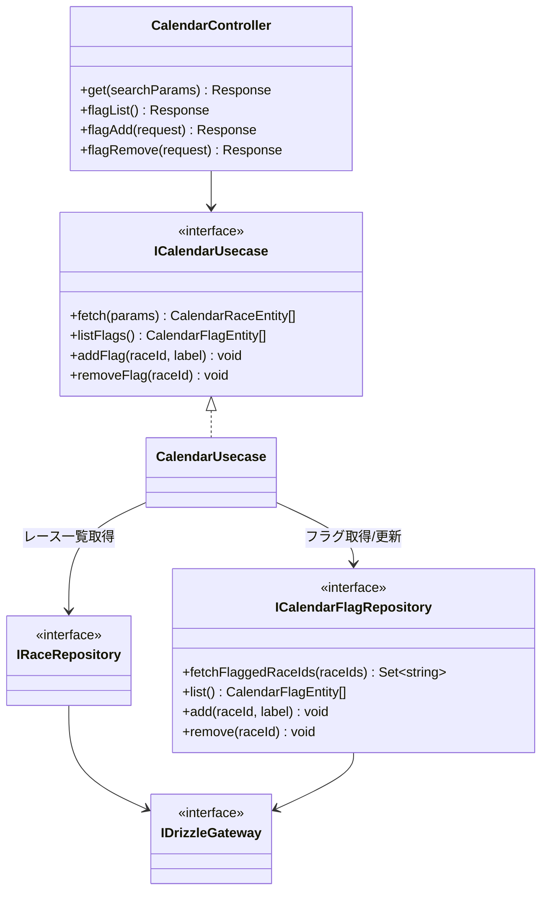
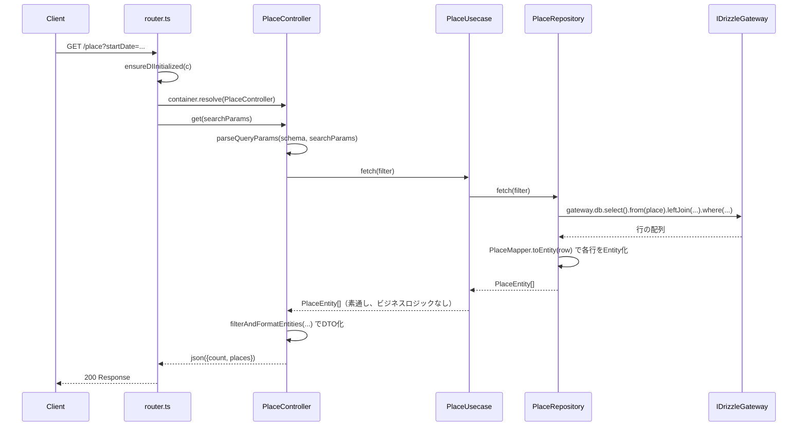
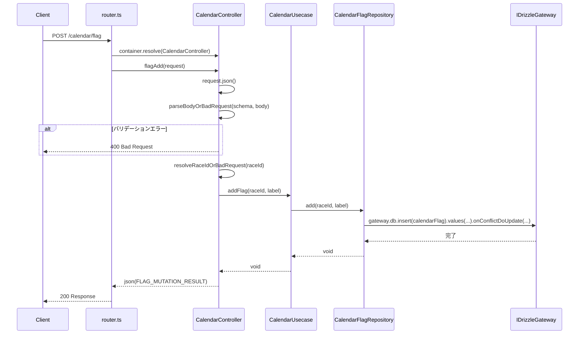

# race-schedule-api

Cloudflare Workers上で動作するAPIサーバー。**D1（SQLite）唯一のアクセス点**であり、Google Calendar 等の外部連携は行わない（Google Calendar 連携は `@race-schedule/calendar` Worker が担当）。設計の背景は [calendar-extraction-design.md](../../aidlc-docs/inception/reverse-engineering/calendar-extraction-design.md) を参照。

## 環境構成

| 環境       | Worker名             | 用途           |
| ---------- | -------------------- | -------------- |
| test       | `race-schedule-test` | 開発・テスト用 |
| production | `race-schedule-prod` | 本番用         |

## ローカル開発

### 開発サーバーの起動

```bash
bun run dev
```

このコマンドは `wrangler dev --remote --env test` を実行し、Cloudflare上のtest環境（secrets, D1）を使用してローカル開発ができます。

```
ローカルPC                         Cloudflare
┌─────────────┐                   ┌─────────────────────┐
│ wrangler dev│ ──── API ────→   │ race-schedule-test  │
│  --remote   │                   │  ├── Secrets        │
│             │ ←── 実行結果 ───  │  └── D1 Database    │
└─────────────┘                   └─────────────────────┘
```

### 完全ローカルで開発する場合

ネットワーク接続なしで開発したい場合は、`.dev.vars`を作成してローカルモードを使用:

```bash
bun run dev:local
```

`api` は D1 のみを使い、R2 などの外部ストレージには接続しません（R2 を使うのは `scraping` Worker）。
`.dev.vars` は D1 の Secrets（`setup-secrets.sh` が Cloudflare Secrets から流し込む値）のみで足ります。

> Google Calendar 関連の環境変数（`GOOGLE_CLIENT_EMAIL` / `GOOGLE_PRIVATE_KEY` / `*_CALENDAR_ID`）は `@race-schedule/api` では使用しません。Google Calendar 連携は `@race-schedule/calendar` Worker に分離されています。設定が必要な場合は [../calendar/SETUP.md](../calendar/SETUP.md) を参照してください。

## デプロイ

### 初回セットアップ（1回のみ）

Cloudflare Workersにsecretsを設定する必要があります。

```bash
# test環境
./scripts/setup-secrets.sh test

# production環境
./scripts/setup-secrets.sh production
```

このスクリプトは`.dev.vars`から値を読み取り、Cloudflare Workersのsecretsとして設定します。

### デプロイ方法

#### 自動デプロイ（GitHub Actions）

| 環境        | トリガー                                                          |
| ----------- | ------------------------------------------------------------------ |
| development | `deploy-development`ラベル付与、または`workflow_dispatch`手動実行 |
| test        | `main`ブランチへのpush（自動）、または`workflow_dispatch`手動実行  |
| production  | `v*`タグのpush、または`workflow_dispatch`手動実行                 |

いずれも統合ワークフロー [`.github/workflows/deploy.yml`](../../.github/workflows/deploy.yml)
（`deploy-api-reusable.yml`を呼び出す）が担う。旧`deploy-test`/`deploy-production`ラベルは
test環境=常にmainの最新状態という前提（UAT smokeが直接test環境URLを叩く）を守るため廃止済み
（詳細は[`packages/README.md`](../README.md#環境別デプロイ詳細)、経緯は
[`aidlc-docs/inception/plans/execution-plan-release-strategy.md`](../../aidlc-docs/inception/plans/execution-plan-release-strategy.md)）。
production前後には`pre-release-verify`/`post-merge-verify`ジョブがsIT/UAT smokeでゲートする。

#### 手動デプロイ

```bash
# test環境
bun run deploy:test

# production環境
bun run deploy:production
```

## アーキテクチャ

```
リクエスト
    │
    ▼
Cloudflare Workers (race-schedule-test / race-schedule-prod)
    │
    └── D1 Database (race-schedule-db-test / race-schedule-db-prod)
```

`GET /calendar` はレース情報とカレンダー登録フラグ（いずれも D1）からレスポンスを組み立てるのみで、Google Calendar API へは問い合わせません。Google Calendar との実際の同期は `@race-schedule/calendar` Worker が別途 `GET /race` / `GET /calendar/flag` を叩いて行います。

### クラス図（抽象・レイヤー関係）

Place / Race / Player は同型の4層構造（Controller → Usecase → Repository → Gateway）です。tsyringe の DI コンテナがコンストラクタ注入で各層を解決します（`di/infrastructure.ts` / `di/application.ts`）。

```mermaid
classDiagram
    class XxxController {
        +get(searchParams) Response
        +upsert(request) Response
    }
    class IXxxUsecase {
        <<interface>>
        +fetch(filter) XxxEntity[]
        +upsert(entityList) UpsertResult
    }
    class XxxUsecase
    class IXxxRepository {
        <<interface>>
        +fetch(filter) XxxEntity[]
        +upsert(entityList) UpsertResult
    }
    class XxxRepository
    class IDrizzleGateway {
        <<interface>>
        +db DrizzleD1Database
    }
    class DrizzleGateway

    XxxController --> IXxxUsecase
    IXxxUsecase <|.. XxxUsecase
    XxxUsecase --> IXxxRepository
    IXxxRepository <|.. XxxRepository
    XxxRepository --> IDrizzleGateway
    IDrizzleGateway <|.. DrizzleGateway : 本番(D1) / 開発・テスト(bun:sqlite)
```

`DrizzleGateway` は本番・開発/テストで同一クラスを使う（`EnvStore.env.DB` を実行時に読み直すため）。テストでは `EnvStore.env.DB` を `bun:sqlite` ベースの D1 互換アダプタ（`createInMemoryD1Database()`）に差し替えることで、本番と同じ Drizzle クエリをそのまま実行できる。マイグレーションの正は `packages/db/migrations/*.sql`（wrangler d1 migrations）で、`src/db/schema.ts` はそれに手動で追従させる Drizzle スキーマ定義。

#### `drizzle-orm`のD1互換方針（DEP-027）

`drizzle-orm`は`^0.45.2`（`packages/api/package.json`）を使用し、`drizzle-orm/d1`エントリ経由で
Cloudflare D1（`D1Database`バインディング）にアクセスする。バージョン選定・アップグレード時は
以下を確認する。

- **選定理由**: `drizzle-orm/d1`はCloudflareの`D1Database`型（`@cloudflare/workers-types`）を
  そのままラップするアダプタであり、D1側のAPI変更（`prepare`/`batch`/`exec`等のメソッド仕様）に
  追従したバージョンを使う必要がある。`^0.45.2`は現在の`@cloudflare/workers-types`
  （`^5.20260714.1`、DEP-002参照）と組み合わせた動作確認済みの組み合わせ。
- **保証範囲**: D1固有API（`drizzle-orm/d1`のバッチ実行・トランザクション制約等）の
  破壊的変更は、`drizzle-orm`本体のCHANGELOGだけでは検知しづらい。アップグレード時は
  [drizzle-orm CHANGELOG](https://github.com/drizzle-team/drizzle-orm/releases)に加え、
  本パッケージの`bun test`（`test/unittest/gateway/`、`bun:sqlite`ベースのD1互換アダプタ
  経由）と`test:sit`（実D1経由、miniflare）の両方を実行して回帰が無いか確認すること。
- **`drizzle-kit`は意図的に不使用**（`packages/db/README.md`参照）: マイグレーションSQLは
  手動管理（`packages/db/migrations/*.sql`）が正であり、`src/db/schema.ts`はそれに人手で
  追従させるスキーマ定義。`drizzle-orm`のアップグレードでスキーマ定義の型が変わった場合は
  `bun run type-check`で検知できるが、SQL側の非互換は自動検知できない点に注意（DEP-026で
  ドリフト検知の要否を別途検討）。

Xxx = Place / Race / Player（`XxxController.get/upsert` は router.ts の `registerCrud` 経由で共通登録）。

Calendar のみ形が異なり、`CalendarUsecase` が `RaceRepository` と `CalendarFlagRepository` の2つを合成して利用します（`GET /calendar` はレース一覧とフラグ一覧を突き合わせて `isFlagged` 付きの一覧を作る）。



### シーケンス図

**GET /place**（Place/Race/Player 共通パターン）



**POST /calendar/flag**（D1へのフラグ保存のみ、Google Calendar同期は含まない）



> Google Calendar への実反映（イベント追加/削除）は本フローには含まれません。次回の `@race-schedule/calendar` Worker の同期サイクル（`POST /sync`）で反映されます。

### Secretsの仕組み

1. `wrangler secret put`でCloudflareに暗号化して保存
2. Worker実行時に`env`オブジェクトとして渡される
3. コード内で`EnvStore.env.GOOGLE_PRIVATE_KEY`のようにアクセス

### 注意事項

- `.dev.vars`はgitignoreされています。リポジトリにコミットしないでください
- Secretsを更新した場合は再度`setup-secrets.sh`を実行してください
- GitHub Secretsはデプロイ時のCI環境でのみ使用され、Workerランタイムには渡されません
