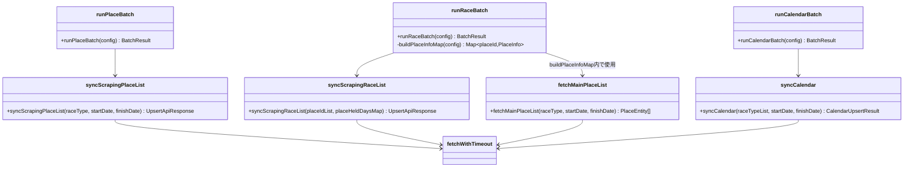
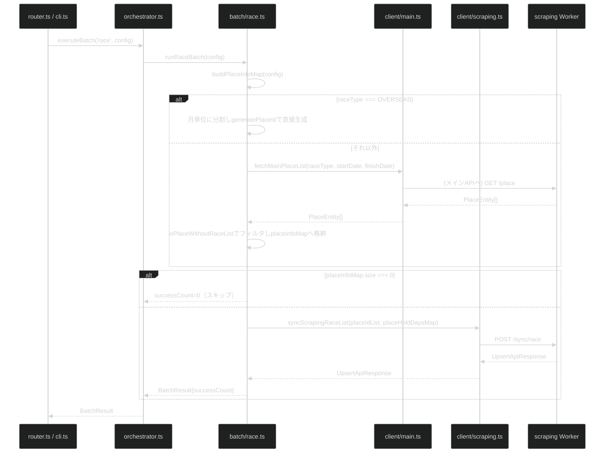
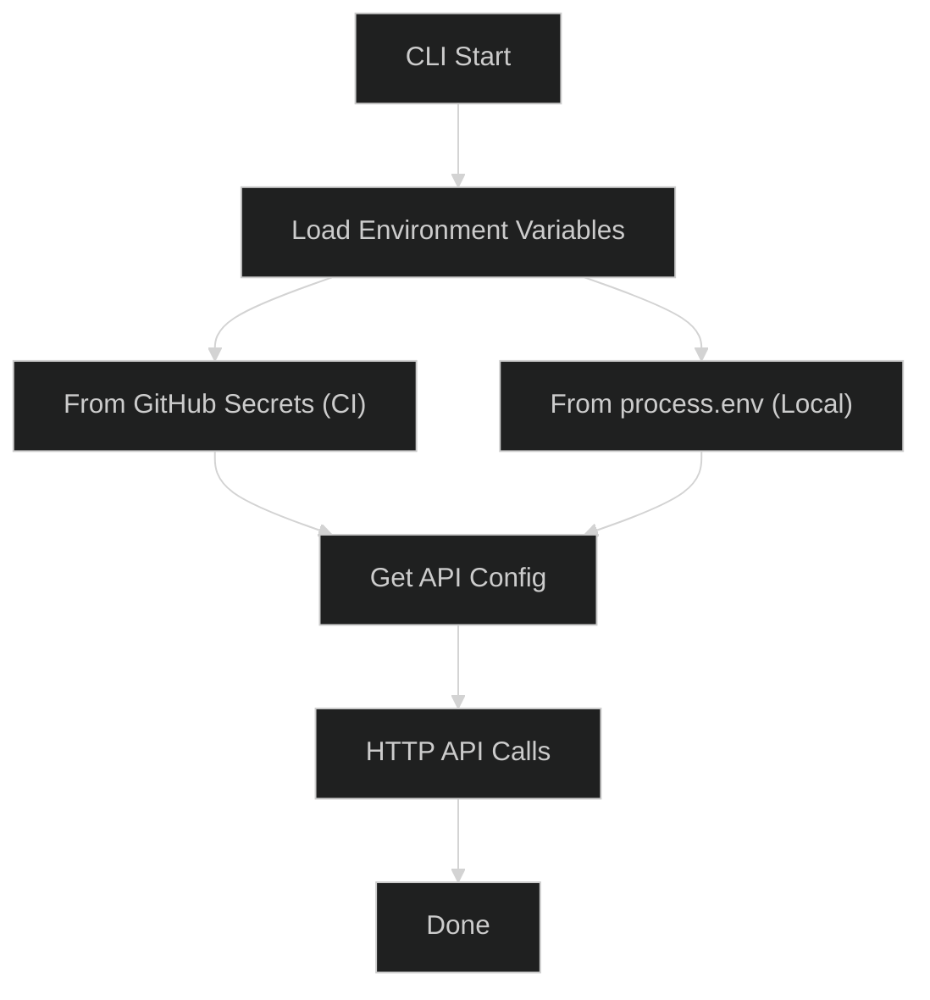

# @race-schedule/batch

バッチ処理: スクレイピング API からデータを取得してメイン API に流し込むスクリプト

## 目次

- [概要](#概要)
- [前提条件](#前提条件)
- [クイックスタート](#クイックスタート)
- [アーキテクチャ](#アーキテクチャ)
- [環境設定](#環境設定)
- [実行方法](#実行方法)
- [開発ガイド](#開発ガイド)
- [テスト計画](#テスト計画)
- [コマンド](#コマンド)
- [トラブルシューティング](#トラブルシューティング)

---

## 概要

`@race-schedule/batch` は、スクレイピング API からレース・場所・カレンダー情報を取得し、メイン API に登録するバッチ処理システムです。

DI コンテナは持たず、「オーケストレーション（`batch/`）→ HTTPクライアント（`client/`）」の薄い2層構成です（詳細は [アーキテクチャ](#アーキテクチャ) 参照）。

### 主要特徴

✅ **薄いオーケストレーション** - scraping/api/calendar Worker への委譲に徹する  
✅ **エラーハンドリング** - 明示的な例外管理  
✅ **拡張性** - 新バッチ・API追加が容易  
✅ **ドライラン対応** - 本番前検証が可能

---

## 前提条件

- Node.js / Bun がインストール済み
- このリポジトリがワークスペース管理されており、ルートの `bun install` が済んでいること

---

## クイックスタート

### インストール

ルートディレクトリで以下を実行:

```bash
bun install
```

### 基本的な実行

```bash
npx tsx src/cli.ts JRA 2026-01-01 2026-01-31 all
```

---

## アーキテクチャ

### 📁 ディレクトリ構造

```
packages/batch/
├── src/
│   ├── cli.ts              # CLI エントリーポイント
│   ├── orchestrator.ts     # メインロジック（executeBatch / executeMultipleBatches）
│   ├── router.ts           # HTTP Worker としてのルーティング（POST /batch）
│   ├── types.ts            # 型定義・環境変数取得（getApiConfig / getCalendarApiUrl）
│   ├── constants.ts        # 定数
│   ├── validation.ts       # 日付範囲バリデーション
│   ├── batch/              # バッチジョブ層（scraping/calendarの同期エンドポイントを呼ぶだけ）
│   │   ├── place.ts        # place: scraping の POST /sync/place を呼ぶ
│   │   ├── race.ts         # race: buildPlaceInfoMap（サービス間調整） + scraping の POST /sync/race を呼ぶ
│   │   └── calendar.ts     # calendar: calendar Worker の POST /sync を呼ぶ
│   └── client/             # 外部 Worker クライアント（HTTPラッパー）
│       ├── http.ts         # HTTP 基本処理（タイムアウト付きfetch）
│       ├── main.ts         # メインAPI（api）クライアント（fetchMainPlaceListのみ）
│       ├── place.ts        # /place 取得の共通処理（main.ts/scraping.tsで共有）
│       ├── scraping.ts     # scraping Worker クライアント（syncScrapingPlaceList/syncScrapingRaceList）
│       └── calendar.ts     # calendar Worker クライアント（syncCalendar）
└── test/
    ├── unittest/           # ユニットテスト
    └── integration/        # 統合テスト
```

`util/` ディレクトリ（DTO→Entity変換ヘルパー）は、scraping/calendar 側が自身の Entity をそのままメインAPIへ Upsert する構成に変わったことで不要になり削除されています。batch に残る唯一の変換・調整ロジックは `batch/race.ts` の `buildPlaceInfoMap`（メインAPI優先で開催場情報を解決し、フォールバック時の判定を行うサービス間調整ロジック）です。

### 🏗️ レイヤー構造

`controller`/`usecase`/`repository`のような層は持たず、「オーケストレーション(`batch/`)」と「HTTPクライアント(`client/`)」の2層のみで構成されます（DTO→Entity変換やDB操作はscraping/api/calendar Worker側が担うため、batchには不要）。

```mermaid
%%{init: { 'theme': 'dark' }}%%
graph TB
    ENTRY["🔧 起動点<br/>cli.ts (CLI) / router.ts (POST /batch)"]
    MAIN["🧭 orchestrator.ts<br/>executeBatch / executeMultipleBatches"]
    ORCH["🎯 batch/ オーケストレーション<br/>runPlaceBatch / runRaceBatch / runCalendarBatch"]
    CLIENT["🌐 client/ HTTPクライアント<br/>scraping.ts / main.ts / calendar.ts"]
    HTTP["🛠️ client/http.ts<br/>fetchWithTimeout"]
    API["🔌 scraping / api / calendar Worker"]

    ENTRY --> MAIN
    MAIN --> ORCH
    ORCH --> CLIENT
    CLIENT --> HTTP
    HTTP --> API

    style ORCH fill:#3a1a3f
    style CLIENT fill:#1a3f1a
```



### クラス図（抽象・関数間の依存関係）



### 🔀 実行フロー: race batch（buildPlaceInfoMapを含む代表例）



`runPlaceBatch`は`syncScrapingPlaceList`を1回呼ぶだけ、`runCalendarBatch`は`syncCalendar`を1回呼ぶだけのさらに単純なフローです（いずれもscraping/calendar Worker側が実処理を完結させるため）。

---

## 環境設定

### 環境変数の優先度（高 → 低）

バッチ起動時、環境変数は以下の優先度で決定されます:

1. **コマンドライン引数** - 実行時の環境変数指定  
   `SCRAPING_API_URL=https://xxx npx tsx src/cli.ts ...`

2. **OS 環境変数** - プロセス環境に既に設定されている変数

3. **dotenv ファイル** - `.env` または `.env.test` から読み込み

### 環境設定フロー



    style C fill:#3f2a1a
    style D fill:#3f2a1a
    style H fill:#2a6c2a

````

### .env ファイル設定

#### ローカル開発用 (.env)

```bash
cp .env.example .env
````

```env
# スクレイピングAPI（place/raceの同期エンドポイント呼び出し先）
SCRAPING_API_URL=<スクレイピング API の URL>

# メインAPI（buildPlaceInfoMapのメインAPI優先取得のみで使用）
MAIN_API_URL=<メイン API の URL>

# カレンダー同期Worker（calendarバッチの同期エンドポイント呼び出し先）
CALENDAR_API_URL=<カレンダー同期 Worker の URL>
```

具体的な URL 値は環境によって異なります。ルートの `.env.example` を参照してください。

#### テスト環境用 (.env.test)

```bash
cp .env.test.example .env.test
```

```env
TEST_SCRAPING_API_URL=<テスト環境のスクレイピング API URL>
TEST_MAIN_API_URL=<テスト環境のメイン API URL>
```

---

## 実行方法

### CLI コマンド形式

```bash
npx tsx src/cli.ts <RACE_TYPE> <START_DATE> <END_DATE> <RACE_CATEGORY>
```

### パラメータ説明

| パラメータ    | 説明                | 例                                |
| ------------- | ------------------- | --------------------------------- |
| RACE_TYPE     | レース種別          | JRA, NAR, KEIRIN, AUTORACE, WORLD |
| START_DATE    | 開始日 (YYYY-MM-DD) | 2026-01-01                        |
| END_DATE      | 終了日 (YYYY-MM-DD) | 2026-01-31                        |
| RACE_CATEGORY | レースカテゴリ      | all, sprint, middle, long         |

### 実行例

```bash
# JRA 1月1日～31日の全レース
npx tsx src/cli.ts JRA 2026-01-01 2026-01-31 all

# NAR の短距離競走
npx tsx src/cli.ts NAR 2026-02-01 2026-02-28 sprint

# 競輪 全レース
npx tsx src/cli.ts KEIRIN 2026-03-01 2026-03-30 all
```

### 環境設定

**CI Environment (GitHub Actions)**:

- 環境変数は GitHub Secrets から direct に注入される
- `SCRAPING_API_URL` と `MAIN_API_URL` が設定される

**Local Development**:

```bash
# 環境変数を設定してから実行
export SCRAPING_API_URL="https://example.com/scraping"
export MAIN_API_URL="https://example.com/api"
npx tsx src/cli.ts JRA 2026-01-01 2026-01-31 all
```

### スケジューリング

#### GitHub Actions での自動実行

バッチは `.github/workflows/batch-*.yml` で定期的に実行されます。

#### ローカルスケジューリング（cron）

```cron
# 毎日午前3時に JRA レースをスクレイピング
0 3 * * * cd /path/to/race-schedule && npx tsx packages/batch/src/cli.ts JRA $(date +\%Y-\%m-\%d) $(date +\%Y-\%m-\%d) all
```

---

## 開発ガイド

### バレルエクスポートパターン

batch は Worker サブ層に個別のバレルを置かない方針（[.claude/docs/coding-conventions.md](../../.claude/docs/coding-conventions.md) 参照）に従っており、`src/batch/`・`src/client/` それぞれに `index.ts` はありません。`src/index.ts` は Cloudflare Workers のハンドラとして `router` を default export するのみで、`batch/`・`client/` 配下の関数を束ねる役割は持ちません。パッケージ内部の呼び出しは `./batch/place` のような相対パスで直接参照します。

### 開発時のチェックリスト

DI コンテナは存在しない（`src/di.ts` は無い）ため、新規追加は `orchestrator.ts` の分岐にケースを足すだけで完結します。

#### 新しいバッチサービスを追加する場合

- [ ] `src/batch/{name}.ts` を作成
- [ ] `src/orchestrator.ts` のバッチターゲット分岐に case を追加

#### 新しいクライアントを追加する場合

- [ ] `src/client/{name}.ts` を作成
- [ ] `src/client/http.ts` の `fetchWithTimeout` を使用して HTTP 通信を実装
- [ ] 呼び出し元（`src/batch/{name}.ts`）から相対パスで import

---

## テスト状況

| 対象                                          | UT  | Component | 備考                                          |
| --------------------------------------------- | :-: | :-: | --------------------------------------------- |
| CLI（`cli.ts`）                               | ✅  | ✅  | `cli.test.ts`, `cli.unit.test.ts`, コンポーネントテスト1本    |
| `orchestrator.ts`（executeBatch）             | ✅  | ✅  | コンポーネントテストで place/race/calendar 一括のフローを検証 |
| `batch/{place,race,calendar}.ts`              | ✅  |  -  | `buildPlaceInfoMap` を含むテストあり          |
| `client/{http,main,scraping,calendar}.ts`     | ✅  |  -  | HTTP クライアント各層                         |
| `router.ts`                                   | ✅  |  -  | `router.test.ts`, `router.error.test.ts`      |
| `validation.ts` / `types.ts` / `constants.ts` | ✅  |  -  |                                               |

C0/C1 カバレッジ100%（`test/unittest/`・`test/integration/component/` 計17ファイル）。詳細は `bun run test:gap` で確認。

---

## コマンド

```bash
# Lint チェック
bun run lint

# Lint の自動修正
bun run lint:fix

# 型チェック
bun run type-check
```

---

## トラブルシューティング

### API 接続エラー

```
Error: Failed to fetch from SCRAPING_API_URL
```

**確認事項:**

1. 環境変数 `SCRAPING_API_URL` / `MAIN_API_URL` / `CALENDAR_API_URL`（calendarバッチ実行時）が正しく設定されているか
2. バックエンド Worker（scraping / api / calendar）が起動している・アクセス可能か
3. ネットワーク接続は正常か

```bash
# API へのアクセス確認
curl "${MAIN_API_URL}/health"
```

### 環境変数が読み込まれない

```bash
# 優先度を確認
export DEBUG=*
npx tsx src/cli.ts JRA 2026-01-01 2026-01-31 all 2>&1 | grep -i env
```

### データベース接続エラー

バッチの実行前に D1 データベースのマイグレーションが適用されていることを確認:

```bash
cd packages/db
bun run migrations:apply:local
```

---

## 注意事項

⚠️ 秘匿情報（API URL 等）はリポジトリに直接コミットしないでください  
⚠️ `.env` / `.env.test` にはリモートリポジトリに機密情報を格納しないでください  
⚠️ AWS SSM Parameter Store の認証情報は安全に管理してください
