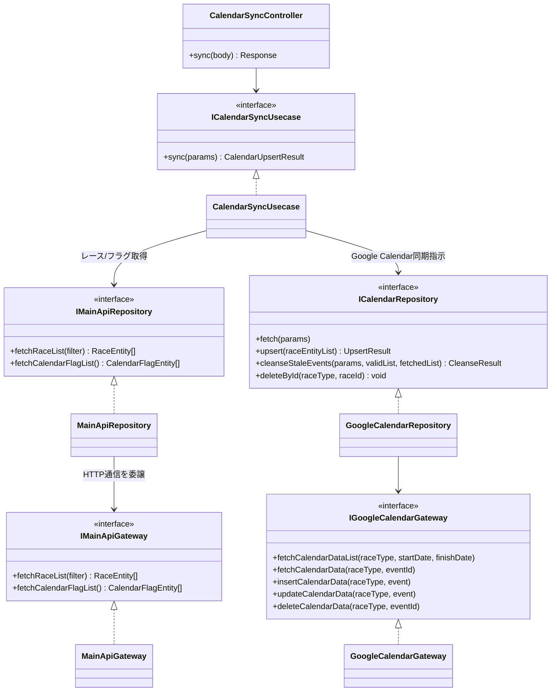
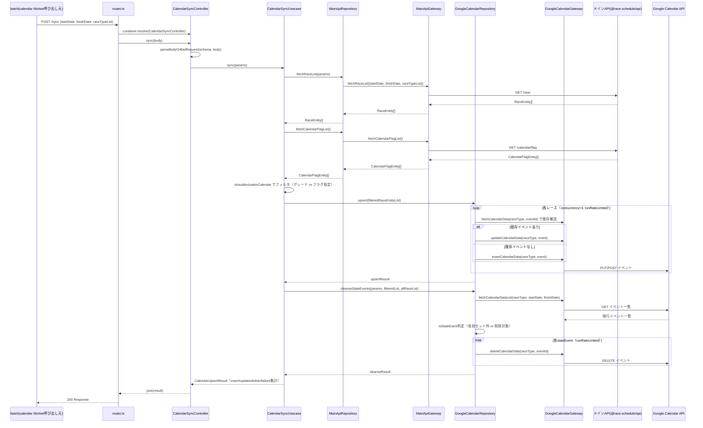

# Calendar Worker

メインAPI（`@race-schedule/api`）のレース・カレンダー登録フラグ情報を取得し、Google Calendar への同期を担う Cloudflare Worker です。

`api` が D1 唯一のアクセス点であるという方針のもと、Google Calendar 連携（Google 認証、イベント CRUD、レート制限対応）はこの Worker に集約されています。`calendar` は D1 に直接アクセスしません。

設計の背景・全体アーキテクチャは [calendar-extraction-design.md](../../aidlc-docs/inception/reverse-engineering/calendar-extraction-design.md) を参照してください。

## エンドポイント

`GET /health`（と `OPTIONS`）以外はすべてサービス間認証が必須（`X-Service-Auth-Token`
ヘッダ、deny-by-default）。トークンが一致しない場合 `401 Unauthorized`。詳細は
[`docs/specs/SPEC-API-001.md`](../../docs/specs/SPEC-API-001.md)、ローカルでの設定方法は
[`SETUP.md`](SETUP.md) を参照。

### GET /health

ヘルスチェック用エンドポイント。

```bash
curl "http://localhost:8788/health"
```

### POST /sync

指定期間・レース種別のレースをメインAPIから取得し、カレンダー登録フラグ（`calendar_flag`）と突き合わせて Google Calendar へ同期します。

**リクエストボディ:**

```json
{
    "startDate": "2026-01-01",
    "finishDate": "2026-01-31",
    "raceTypeList": ["jra", "nar"]
}
```

```bash
curl -X POST "http://localhost:8788/sync" \
  -H "Content-Type: application/json" \
  -H "X-Service-Auth-Token: $SERVICE_AUTH_TOKEN" \
  -d '{"startDate":"2026-01-01","finishDate":"2026-01-31","raceTypeList":["jra"]}'
```

**レスポンス:** `CalendarUpsertResult`（`successCount` / `insertedCount` / `updatedCount` / `deletedCount` / `failureCount` / `failures`）

処理の流れ:

1. メインAPIの `GET /race` で対象期間のレース一覧を取得
2. メインAPIの `GET /calendar/flag` でカレンダー登録フラグ一覧を取得
3. `shouldIncludeInCalendar`（重賞グレード or フラグ指定）でカレンダー掲載対象を絞り込み
4. Google Calendar へ Upsert
5. 対象期間内で不要になったイベント（レース変更等による残留）を削除

## アーキテクチャ

```
Controller層  → HTTPリクエスト/レスポンス処理（POST /sync）
    ↓
Usecase層     → 同期ロジック（レース取得 → フラグ結合 → フィルタ → Upsert指示）
    ↓
Repository層  → MainApiRepository（メインAPIから同期元データ取得）
             / GoogleCalendarRepository（Google Calendarへの反映）
    ↓
Gateway層     → MainApiGateway（メインAPIとのHTTP通信）
             / GoogleCalendarGateway（Google Calendar APIとの通信）
```

`api`/`scraping` と同じレイヤードアーキテクチャ・tsyringe による DI パターンを踏襲しています。**Usecase は Gateway を直接呼ばず、必ず Repository を経由します**（controller → usecase → repository → gateway の順序。詳細は [.claude/docs/coding-conventions.md](../../.claude/docs/coding-conventions.md) の「レイヤー依存の順序」）。

### クラス図（抽象・レイヤー関係）



`GoogleCalendarGateway`/`GoogleCalendarRepository` は元々 `@race-schedule/api` にあった実装をそのまま移設したもの（D1 に依存しないため無変更で移設可能）です。

### シーケンス図



## ローカル開発

```bash
bun run dev
```

## デプロイ

```bash
bun run deploy:development
bun run deploy:test
bun run deploy:production
```

> **注意**: 本Workerのデプロイパイプライン（GitHub Actions の `deploy-calendar-reusable.yml` 等）はまだ整備されていません。手動デプロイ、または `wrangler deploy` を直接実行してください。詳細は設計書の「未対応・フォローアップ事項」を参照。

## 環境変数

| 変数名                                                                                                                                                           | 説明                                          |
| ---------------------------------------------------------------------------------------------------------------------------------------------------------------- | --------------------------------------------- |
| `MAIN_API_URL`                                                                                                                                                   | メインAPI（`@race-schedule/api`）のベースURL  |
| `GOOGLE_CLIENT_EMAIL`                                                                                                                                            | Google サービスアカウントのクライアントメール |
| `GOOGLE_PRIVATE_KEY`                                                                                                                                             | Google サービスアカウントの秘密鍵             |
| `JRA_CALENDAR_ID` / `NAR_CALENDAR_ID` / `OVERSEAS_CALENDAR_ID`（旧 `WORLD_CALENDAR_ID`）/ `KEIRIN_CALENDAR_ID` / `AUTORACE_CALENDAR_ID` / `BOATRACE_CALENDAR_ID` | レース種別ごとの Google Calendar ID           |
| `CORS_ALLOWED_ORIGINS`                                                                                                                                           | CORS許可オリジン（カンマ区切り、任意）        |

セットアップ手順は [SETUP.md](SETUP.md) を参照してください。

## テスト

```bash
bun test
bun test --coverage
```

`src/gateway/implement/googleCalendarGateway.ts` と `src/repository/implement/googleCalendarRepository.ts` は、元々 `@race-schedule/api` にあった実装をそのまま移設したものです（D1 に依存しない純粋な Google Calendar API ラッパーのため無変更で移設可能でした）。
