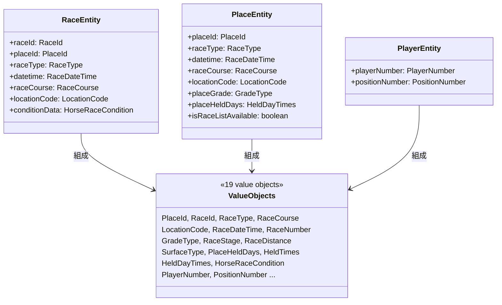

# @race-schedule/core

api / batch / calendar / scraping のすべてから依存される共有ライブラリです（front は Flutter/Dart 製で、TS パッケージとしては依存せず api と HTTP 契約でのみ結合します）。他パッケージへは依存しません（最下層）。独自の HTTP サーバーや DI コンテナの実体は持たず、ドメインモデル・共通ユーティリティ・型定義の集合体です。

## パッケージ構成

```
packages/core/src/
├── domain/       # ドメインモデル（値オブジェクト・エンティティ組成部品）・ルール・ポリシー・サービス
│   ├── model/valueObject/  # PlaceId, RaceId, RaceType, GradeType 等19種の値オブジェクト
│   ├── rule/               # raceInvariants（raceType毎の整合性検証）
│   ├── policy/             # calendarInclusion（カレンダー掲載可否）, eventVisibility 等
│   └── service/            # identifier生成、courseCode変換、gradeInference 等のドメインサービス
├── entity/       # Zodスキーマ付きエンティティ（RaceEntity/PlaceEntity/PlayerEntity/CalendarDataEntity/CalendarFlagEntity）
├── dto/          # パッケージ間受け渡し用データ構造（永続化スキーマを持たない、例: CalendarFilterParams）
├── schemas/      # クエリパラメータ・upsertペイロードのZodバリデーションスキーマ
├── utilities/    # ロガー、JST日付処理、URL生成、platform/（DI初期化・環境変数ラッパー）等の汎用関数
├── http/         # 各パッケージのrouterが共通利用するCORS・エラーレスポンス・パーサ等
├── types/        # UpsertApiResponse、ValidationError等の横断的型
└── constants/    # DI_TOKENS、YouTubeユーザIDマップ等の定数
```

## ドメインモデルの構成

値オブジェクト（`domain/model/valueObject/`）を組み合わせて3大エンティティ（`entity/`）が構成されます。



`domain/rule/raceInvariants.ts`（Zodの`superRefine`）が raceType 毎の整合性を検証し、`domain/policy/`（`calendarInclusion`, `eventVisibility`等）と `domain/service/`（identifier生成、courseCode変換、gradeInference等）がこれらの値オブジェクト・エンティティを操作するドメインサービス/ポリシー層です。

## http/ の主要エクスポート（`src/http/index.ts` がバレル）

| ファイル                                                                                 | 主なexport                                                               | 役割                                                                               |
| ---------------------------------------------------------------------------------------- | ------------------------------------------------------------------------ | ---------------------------------------------------------------------------------- |
| `cors.ts`                                                                                | `getAllowedOrigins`, `withCorsHeaders`                                   | `CORS_ALLOWED_ORIGINS`環境変数に基づくホワイトリストCORS                           |
| `errorResponse.ts`                                                                       | `internalErrorResponse`, `internalErrorResponseBody`, `logInternalError` | 500系エラーの共通ログ・レスポンス組み立て                                          |
| `response.ts`                                                                            | `json`, `badRequest`                                                     | 成功/400レスポンスの共通生成                                                       |
| `parse.ts` / `parseOrBadRequest.ts` / `parseBodyOrBadRequest.ts` / `queryParamParser.ts` | `parseQueryParams`, `parseRaceSearchParams`等                            | Zodスキーマによるリクエストパース補助                                              |
| `cacheControl.ts`                                                                        | `buildCacheControlHeader`, `isCacheableGetResponse`                      | GETレスポンスのCache-Control制御                                                   |
| `fetchWithTimeout.ts`                                                                    | `fetchWithTimeout`, `FETCH_TIMEOUT_MS`                                   | サービス間HTTP通信の共通タイムアウト付きfetch（api/batch/scraping/calendarが利用） |

各パッケージのrouterはこれらをimportしてCORSヘッダー付与・エラーレスポンス生成・クエリパースを共通化しています。

## 使用例

```typescript
import {
    DI_TOKENS,
    EnvStore,
    LogAllMethods,
    appLogger,
    fetchWithTimeout,
    json,
} from '@race-schedule/core';
import type { RaceEntity, CalendarFlagEntity } from '@race-schedule/core';
```

## DI_TOKENS

`src/constants/diTokens.ts` に、tsyringe の `container.register`/`@inject` で使う文字列トークンを Gateway/Repository/Usecase 等のカテゴリで一元管理しています。core は DI コンテナの実体を持たず、トークン定数のみを提供し、各パッケージ（api/batch/calendar/scraping）が個別にコンテナへ登録します。

## 注意事項

- 本パッケージは他のパッケージに依存しません（最下層）。逆に、他パッケージへの依存や特定パッケージ固有のロジック（controller/usecase/gateway実装等）は持ち込まないでください。
- パッケージ境界のルール（`import/no-relative-packages`）により、他パッケージは必ず `@race-schedule/core`（barrel export）経由でimportします。詳細は [.claude/docs/coding-conventions.md](../../.claude/docs/coding-conventions.md) を参照。
