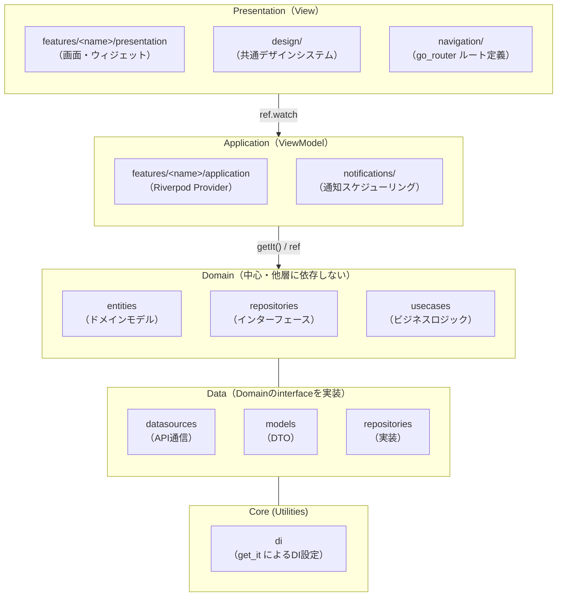
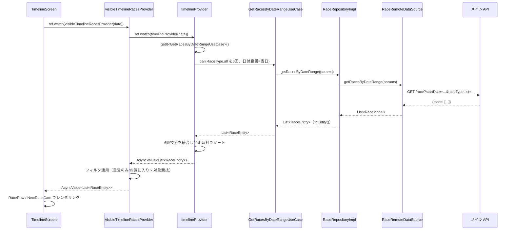
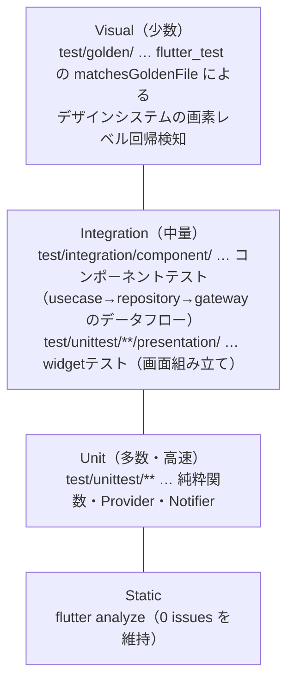
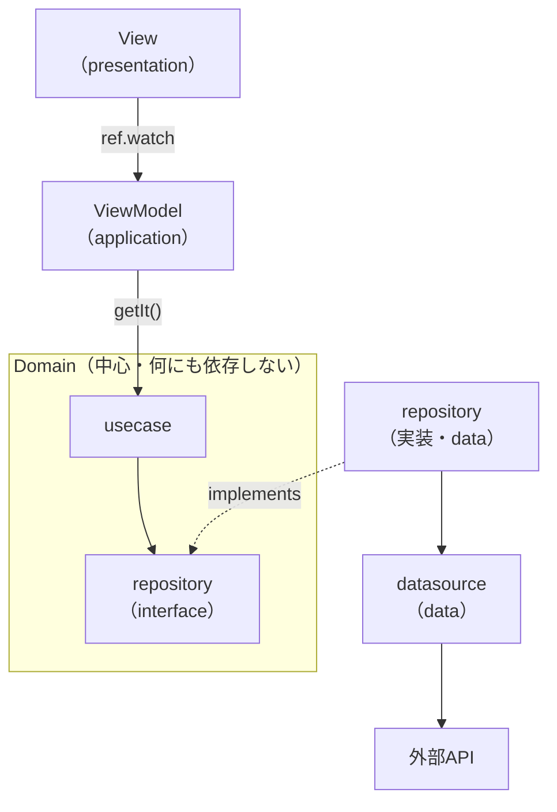

# アーキテクチャドキュメント

## 概要

このアプリケーション（開催盤）は、公営競技（中央競馬・地方競馬・海外競馬・競輪・
オートレース・競艇）を発走時刻順の1本のタイムラインに統合して表示する。
Flutter + Riverpod による **フィーチャー単位のレイヤードアーキテクチャ**を採用する。

Domain / Data 層は API 通信を伴う既存の Clean Architecture 構成をそのまま踏襲し、
UI 側は画面（タブ）ごとの `features/<name>/{application,presentation}` にまとめる。

### アーキテクチャパターンの対応関係（MVVM + Clean Architecture）

用語こそ「フィーチャー単位のレイヤードアーキテクチャ」だが、実体は
**MVVM**（View/ViewModel）と**Clean Architecture**（Domainを中心とした依存性逆転）
を組み合わせたものである。

| パターン上の役割 | このリポジトリでの実体 |
| --- | --- |
| **View**（MVVM） | `features/<name>/presentation` の `*_screen.dart`（`ConsumerWidget`） |
| **ViewModel**（MVVM） | `features/<name>/application` の Riverpod `Provider`/`NotifierProvider`/`FutureProvider` |
| **Domain**（Clean Architecture・中心） | `domain/entities`・`domain/repositories`（interface）・`domain/usecases`。**他のどの層にも依存しない**、最も独立した層 |
| **Data**（Clean Architecture・外側） | `data/repositories`（Domainのinterfaceを実装）・`data/datasources`・`data/models` |

Clean Architectureの核心は「依存性はすべてDomainへ向かって内向きに集まり、
Domain自身は何にも依存しない」という点にある。View→ViewModel→Domainへ向かう
依存と、Data（repository実装）がDomainのinterfaceを実装することで内向きに依存する
構図の両方を、後述の「依存性の方向」で図示する。

## レイヤー構成



> この図は「画面からどうたどり着くか」という**フォルダ構成と呼び出しの順序**を
> 表すための整理図であり、依存の向き（何が何に依存してよいか）を表すものでは
> ない。Domain-Data間を実線の矢印にせず`---`（無方向）にしているのはそのため。
> **実際の依存方向**（Domainが中心で、Dataがそこへ依存性逆転する）は次節
> 「依存性の方向」で図示する。

### 各層の責務

#### 1. features/\<name\>/presentation（MVVMの View）

- 画面（`*_screen.dart`）とその画面固有のウィジェット
- `ConsumerWidget`/`ConsumerStatefulWidget` で `application/` の Provider を購読する
- 見た目の共通部品（アイコン・バッジ・行など）は `design/widgets/` から参照する
- ビジネスロジックを持たない（ロジックはViewModelであるapplication層に置く）

#### 2. features/\<name\>/application（MVVMの ViewModel）

- Riverpod の `Provider`/`NotifierProvider`/`FutureProvider` を定義
- `getIt<T>()`（Domain の UseCase）または他の Provider を組み合わせてビジネス
  ロジック・フィルタリング・整形を行う
- 純粋関数として切り出せるロジック（フィルタ判定・時刻計算など）は同ディレクトリの
  トップレベル関数として定義し、UT で検証する

#### 3. design/（デザインシステム）

- `tokens.dart`: `AppColors`（`ThemeExtension`）。ニュートラル配色と、グレードとは
  無関係な `danger`/`favorite` アクセントトークンのみを保持する
- `typography.dart`: `AppTypography`
- `google_calendar_colors.dart`: `GoogleCalendarColorKey`・`GoogleCalendarPalette`。
  Google Calendar のイベント色（`packages/core` の `GoogleCalendarColor` を
  単一の正典として手動同期）をそのまま踏襲した背景色・前景色
- `grade_tier.dart`: `GradeTier` 判定（`gradeTierOf`/`isCalendarSpecifiedGrade`、絞り込み
  フィルタ用）と、`googleCalendarColorKeyOf`（グレード→表示色の判定。
  `packages/core` の `GoogleCalendarColorKeyMap` を単一の正典として手動同期）
- `widgets/`: 画面をまたいで再利用する共通ウィジェット
  （`GradeBadge`/`RaceRow`/`NextRaceCard`/`MonthCalendarGrid`/`FilterChipsBar`/
  `SettingsGroup` 系/`EmptyState`/`ErrorRetryCard`/`LoadingSkeletonList`/
  `NowDivider`/`DisciplineIcon`）
- `lib/widgetbook.dart`（`flutter run -t lib/widgetbook.dart -d chrome`）で
  トークンとウィジェットカタログを目視確認できる

#### 4. notifications/（通知MVP）

- `INotificationScheduler`: モバイル（`flutter_local_notifications`）／Web
  （no-op スタブ）を `kIsWeb` で切り替える抽象
- レースの発火時刻計算・通知ID導出・通知本文組み立て・重賞抽出は純粋関数として
  分離し、`app.dart`（お気に入り連動）と `timeline_screen.dart`（重賞の自動通知）
  から `ref.listen` で呼び出す

#### 5. Domain 層（Clean Architectureの中心・アプリの軸）

- **Entities**: `RaceEntity` など、不変のドメインモデル
- **Repositories**: データ取得インターフェース（`IRaceRepository` など）
- **UseCases**: `GetRacesByDateRangeUseCase` など、ビジネスロジック
- **他のどのレイヤーにも依存しない**（View/ViewModelはもちろん、Dataにも依存しない）。
  Presentation・Application・Dataの3層はすべてこのDomain層へ向かって依存する側
  （＝Domainが中心。詳細は後述「依存性の方向」）

#### 6. Data 層

- **DataSources**: API 呼び出し（`RaceRemoteDataSource` など、`Dio` を直接使用）
- **Models**: API レスポンスに対応した DTO（`RaceModel` など）
- **Repositories**: Domain 層の Repository インターフェースを実装（＝Domainに依存する側）

#### 7. Core 層

- **DI**: `core/di/service_locator.dart`（`get_it` によるコンポジションルート）、
  `core/di/shared_preferences_provider.dart`

---

## ナビゲーション（go_router）

`navigation/app_router.dart` の `StatefulShellRoute.indexedStack` で、
タイムライン／カレンダー／お気に入り／設定の4タブをそれぞれ独立した状態
（スクロール位置等）を保ったまま切り替える。`AppShell` は画面幅
（`design/breakpoints.dart` の `AppBreakpoints.isWide`）に応じて、モバイル幅では
`NavigationBar`（下部タブ）、広い幅では `NavigationRail`（サイドレール）に
切り替える。

---

## Data Flow（レース一覧取得の例）



---

## 状態管理（Riverpod）

主要な Provider（詳細は各 `application/*.dart` を参照）:

| Provider                                                     | 種類                                         | 役割                                                                                           |
| ------------------------------------------------------------ | -------------------------------------------- | ---------------------------------------------------------------------------------------------- |
| `timelineDateProvider`                                       | `NotifierProvider<DateTime>`                 | タイムラインの表示対象日                                                                       |
| `timelineProvider(date)`                                     | `FutureProvider.family`                      | 当日6競技分のレースを取得・統合ソート（TTL: 15分、下記「キャッシュ戦略」参照）                |
| `visibleTimelineRacesProvider(date)`                         | `Provider.family`                            | フィルタ適用後の表示対象                                                                       |
| `timelineFilterProvider`                                     | `NotifierProvider`                           | 「重賞のみ／お気に入り」の排他モード                                                           |
| `nowProvider`                                                | `StreamProvider`                             | 30秒間隔でtickする現在時刻                                                                     |
| `favoriteIdsProvider`                                        | `NotifierProvider<Set<String>>`              | お気に入りレースID（`SharedPreferences`永続化）                                                |
| `favoriteRacesRawProvider` / `favoriteRacesProvider`         | `FutureProvider` / 派生 `Provider`           | お気に入りレース取得と「発走待ちのみ」フィルタを分離（`nowProvider` のtickで再フェッチしない、TTL: 15分） |
| `calendarMonthProvider` / `calendarMarkersProvider`          | `NotifierProvider` / `FutureProvider.family` | 月カレンダーの月送りとtierマーカー（`calendarMarkersProvider` はTTL: 15分）                    |
| `settingsProvider`                                           | `NotifierProvider<SettingsState>`            | 通知・表示・対象競技の設定（`SharedPreferences`永続化）                                        |
| `notificationSchedulerProvider` / `notificationInitProvider` | `Provider` / `FutureProvider`                | 通知基盤の解決・初期化                                                                         |
| `timelineViewModeProvider`                                   | `NotifierProvider<TimelineViewMode>`         | タイムラインの表示モード（`day`/`all`、既定`day`）                                             |
| `monthRaceChunkProvider(monthKey)`                           | `FutureProvider.family`                      | 月単位（`yyyy-MM`）のレース取得。パラメータ別キャッシュが月の再取得を防ぐ（TTL: 15分）         |
| `loadedMonthsProvider`                                       | `NotifierProvider<List<String>>`             | 全期間タイムラインで読み込み済みの月キー一覧（`loadEarlier`/`loadLater`で拡張）                |
| `allTimelineRacesProvider`                                   | `Provider<AllTimelineData>`                  | 読み込み済み月を統合・ソート・フィルタ適用した全期間タイムラインの表示対象                     |
| `tripGroupsProvider`                                         | `FutureProvider`                             | 旅程グループの候補日検出結果（TTL: 15分）                                                      |

---

## キャッシュ戦略（TTL・手動更新）

API取得結果を持つ主要Providerは、無期限にキャッシュされ続けると内容が陳腐化する一方、
毎回叩き直すとAPIコール数が無駄に増える。このバランスを取るため、以下の2段構えを採用する。

> **範囲の注記**: ここで言う「キャッシュ」は front（Flutter）アプリの
> `ProviderContainer` が保持するインメモリの状態のみを指し、
> `SharedPreferences`・Webの`localStorage`のような永続化層は使っていない
> （アプリ再起動・ページリロードで消え、次回アクセス時にAPIへ再取得する）。
> iOS/Android/Web/デスクトップいずれも同一のDart/Riverpodコードで動くため、
> プラットフォーム間の差異は無い。バックエンド（`packages/api`等のWorker側の
> Cache API/KV等）のキャッシュとは独立しており、本節はfront側のみを扱う。
>
> **層としての位置づけ**: キャッシュは前掲「MVVM + Clean Architecture」でいう
> **ViewModel層（`application/`のProvider自身）に存在する**。Domain層
> （`usecase`）・Data層（`repository`実装・`datasource`）にキャッシュ責務は
> 一切無く、呼ばれるたびに素通しで実行するだけ。専用の「データストレージ層」
> やRepository層のキャッシュデコレータのような構成にはしていない
> （Riverpodの状態保持機構をそのままキャッシュとして使う設計）。
> 現状の要件（APIコール削減・手動更新）に対してはこれで十分と判断しており、
> オフラインファースト（起動直後に前回データを即表示）が必要になった場合は、
> 別途永続化層の追加を検討する。

### TTL（有効期限）による自動失効

`core/riverpod/ttl_refresh.dart` の `scheduleTtlInvalidate(Ref, Duration)` を、対象
Providerの `build` 内から呼ぶことで実現する。内部では `Timer(ttl, ref.invalidateSelf)`
を張り、`ref.onDispose` でタイマーを解放する（build のたびに張り直される）。

- 既定TTLは `defaultCacheTtl`（15分）。個別のProviderで別の値を渡すことも可能だが、
  現状は全対象Providerが既定値を使用している。
- **対象Provider**: `timelineProvider` / `monthRaceChunkProvider` /
  `calendarMarkersProvider` / `favoriteRacesRawProvider` / `tripGroupsProvider`
  （上記Provider一覧表に "TTL: 15分" と記載）。
- 新しくAPI取得系のProviderを追加する場合、無期限キャッシュ（`autoDispose`なしの
  `FutureProvider`/`FutureProvider.family`）にするなら `scheduleTtlInvalidate` を
  併せて呼ぶことを検討する（陳腐化したデータが半永久的に表示され続けるのを防ぐため）。

### 手動更新（更新ボタン・pull-to-refresh）

TTL経過を待たずに即座に最新化したい場合の手段として、対象Providerを持つ全画面
（タイムライン・カレンダー・お気に入り・旅程グループ）に以下を用意している。

- **更新ボタン**: `design/widgets/refresh_icon_button.dart` の `RefreshIconButton`
  をAppBarの `actions` に置き、対象Providerを `ref.invalidate` する。
- **pull-to-refresh**: 標準の `RefreshIndicator` で一覧をラップし、
  `onRefresh` で `ref.invalidate` した上で対象Providerの `.future` を待つ
  （インジケータが結果を待って引っ込むようにするため）。
- 一覧が空・少件数でもジェスチャーが機能するよう、対象の `ListView`/
  `SingleChildScrollView`/`ScrollablePositionedList` には
  `AlwaysScrollableScrollPhysics` を明示している。
- **例外（全期間タイムライン）**: `all_timeline_view.dart` は「今日」を
  `center` sliverキーとした双方向無限スクロール（前掲「全期間タイムライン」節）
  のため、一覧の先頭（`minScrollExtent`）に到達する場面がほぼ無く
  `RefreshIndicator` のpull-to-refreshが実用上機能しない。そのためこの画面のみ
  **更新ボタンのみ対応**（pull-to-refresh非対応は意図的な設計であり、実装漏れではない）。

---

## 全期間タイムライン（双方向無限スクロール）

日別タイムラインと同一画面のトグルで切り替える表示モード（`features/timeline/presentation/all_timeline_view.dart`）。

- **データ取得**: `GetRacesByDateRangeUseCase` を月単位（月初〜月末）のチャンクで呼び出す
  （`monthRaceChunkProvider`）。`FutureProvider.family` はパラメータ（月キー）ごとに結果を
  保持し続けるため、これ自体が「同じ月を再スクロールしても再取得しない」キャッシュとして
  機能する（追加のキャッシュ層は導入していない）。
- **読み込み範囲の管理**: `loadedMonthsProvider`（`LoadedMonthsNotifier`）が現在読み込み済みの
  月キー一覧を保持する。初期値は「今日を含む月とその前後1ヶ月」。スクロールが端に近づくと
  `loadEarlier()`/`loadLater()`で隣接月を1件ずつ追加するが、直前に追加した端の月がまだ
  取得中（`isLoading`）の間は何もしない（高速スクロール中の多重リクエスト防止）。
- **行の組み立て**: `buildTimelineRows()`（純粋関数）が`RaceEntity`の昇順リストから
  日付見出し・レース行・NOWディバイダ行を1本の`List<TimelineRow>`（sealed class）に組み立てる。
  `splitTimelineRows()`が当日境界で過去/未来に分割し、過去側は`.reversed`にする。
- **双方向スクロールUI**: Flutter標準の「`CustomScrollView` + `center` sliverキー」パターンで、
  「今日」を中心に上スクロールで過去、下スクロールで未来を表示する。過去側の`SliverList`は
  centerに最も近い要素（index:0）が直近の過去になるよう、行を反転して渡す。

---

## テスト戦略（テスティングトロフィー）

`static → unit → integration → visual` の順に厚みを持たせる構成
（詳細な決定表・命名規約は `.claude/docs/testing-conventions.md` を参照）。



上ほど少数・厳選（Visual）、下ほど多数・高速（Unit）に厚みを持たせる
「テスティングトロフィー」構成。

- **Unit**: `design/grade_tier.dart`・`notifications/*`・各 `application/*` の
  純粋関数・Notifier をデシジョンテーブル形式（`[T-NN]`）で検証
- **Integration**: `test/integration/component/` のコンポーネントテスト（Dio を
  `InterceptorsWrapper` でフェイクし usecase→repository→gateway のデータフローを
  検証）と、`test/unittest/**/presentation/` の画面 widget テスト
  （Provider を `ProviderScope(overrides: [...])` で差し替え）
- **Visual**: `test/golden/` のゴールデンテスト。実フォントを読み込まず
  （`flutter_test` 既定の決定的フォールバックフォント）マシン依存の差分を避け、
  レイアウト・色トークンの回帰を画素レベルで検知する。内部で
  `DateTime.now()` を使う `NextRaceCard` のような非決定的ウィジェットは対象外
- **TTL（`scheduleTtlInvalidate`）のテスト**: `Timer` を実時間で待つのではなく
  `package:fake_async` の `fakeAsync`/`FakeAsync.elapse` で仮想時間を進める
  （`test/unittest/core/riverpod/ttl_refresh_test.dart` 参照）。`invalidateSelf`
  はマークするだけで即座には再計算されないため、`elapse` の後に一度
  `container.read(...)` してから `flushMicrotasks()` する（読まずに
  `flushMicrotasks()` だけだと再取得が観測できない点に注意）。
- **手動更新（更新ボタン・pull-to-refresh）のテスト**: 対象Providerを
  `overrideWith` でコールカウント付きに差し替え、`tester.tap(find.byIcon(Icons.refresh))`
  または `tester.fling(<一覧内の適当なWidget>, const Offset(0, 300), 1000)` の前後で
  呼び出し回数を比較する（各画面の `*_screen_test.dart` 参照）。一覧が空でも
  pull-to-refreshが機能するのは本体側で `AlwaysScrollableScrollPhysics` を
  指定しているため（前掲「キャッシュ戦略」節）。

---

## ファイル構成

```
lib/
├── domain/
│   ├── entities/           # race_entity.dart, race_type.dart(RaceType/Discipline) 等
│   ├── repositories/
│   └── usecases/
│
├── data/
│   ├── datasources/
│   ├── models/
│   └── repositories/
│
├── design/                 # デザインシステム
│   ├── tokens.dart          # AppColors（ThemeExtension）
│   ├── typography.dart
│   ├── theme.dart
│   ├── grade_tier.dart      # GradeTier判定（絞り込み用）・googleCalendarColorKeyOf
│   ├── google_calendar_colors.dart  # Google Calendar配色（背景色/前景色）
│   ├── breakpoints.dart
│   └── widgets/             # 画面横断の共通ウィジェット
│
├── features/
│   ├── timeline/
│   │   ├── application/     # timeline_provider, timeline_filter_provider 等
│   │   └── presentation/    # timeline_screen.dart, race_detail_sheet.dart
│   ├── calendar/
│   │   ├── application/
│   │   └── presentation/
│   ├── favorites/
│   │   ├── application/
│   │   └── presentation/
│   └── settings/
│       ├── application/
│       ├── domain/          # notification_settings.dart
│       └── presentation/
│
├── notifications/          # 通知MVP（スケジューラ・純粋関数群）
│
├── navigation/
│   └── app_router.dart      # go_router（StatefulShellRoute.indexedStack）
│
├── core/
│   └── di/
│       ├── service_locator.dart        # get_it コンポジションルート
│       └── shared_preferences_provider.dart
│
├── app.dart                 # MaterialApp.router のルート、通知初期化/同期
├── main.dart
└── widgetbook.dart           # デザインシステムのウィジェットカタログ
```

---

## 依存性の方向（Domainを中心とした依存性逆転）

`features/<name>/{presentation,application}`（View/ViewModel）も
`data/`（Data）も、最終的にはすべて **Domain へ向かって依存する**。
Domain（`usecase`/`repository interface`/`entities`）は他のどの層のことも
知らない、唯一「依存される側」専門の層である。



- **View → ViewModel → Domain**: `presentation` は `application` のProviderを
  `ref.watch`し、`application` は `getIt<T>()` 経由でDomainの `usecase` を呼ぶ
  （DI は Riverpod の `ref` ではなく `get_it` で解決）。
- **Data → Domain（依存性逆転）**: `data/repositories` はDomainの
  `repository`インターフェースを**実装**することでDomainに依存する側になる。
  Domain自身は `data/` の存在を一切知らない（importしない）。図でData→Domainの
  矢印を破線＋`implements`にしているのはこの向きを明示するため。
- 上図のとおり、Domainサブグラフには**外へ向かう矢印が無い**（＝他レイヤーに
  依存しない）。これがMVVMの器の中でClean Architectureが実現されている点であり、
  「Domainが軸」というのはこの依存の向きのことを指す。

---

## 今後の拡張性

### 新しい画面（タブ）を追加する場合

1. `features/<name>/application/` に Riverpod Provider を追加
2. `features/<name>/presentation/` に画面ウィジェットを追加
3. `navigation/app_router.dart` の `StatefulShellRoute.indexedStack` に
   ブランチを追加し、`AppShell` のタブ一覧（`_AppDestination`）に加える
4. 画面がAPI取得結果を表示する場合、対象Providerに `scheduleTtlInvalidate`
   （TTL）を付けるか検討し、AppBarに `RefreshIconButton` ＋ 一覧を
   `RefreshIndicator` でラップして手動更新できるようにする
   （「キャッシュ戦略（TTL・手動更新）」節を参照。全期間タイムラインのような
   双方向無限スクロールでpull-to-refreshが機能しない構造の場合は更新ボタンのみでよい）

### 新しいデータソース（外部API等）を追加する場合

1. `domain/entities/` に Entity を追加
2. `domain/repositories/` に Repository interface を追加
3. `domain/usecases/` に UseCase を追加
4. `data/datasources/`・`data/models/`・`data/repositories/` に実装を追加
5. `core/di/service_locator.dart` に DI 登録を追加
6. 呼び出し側の `features/<name>/application/` から `getIt<UseCase>()` で利用
